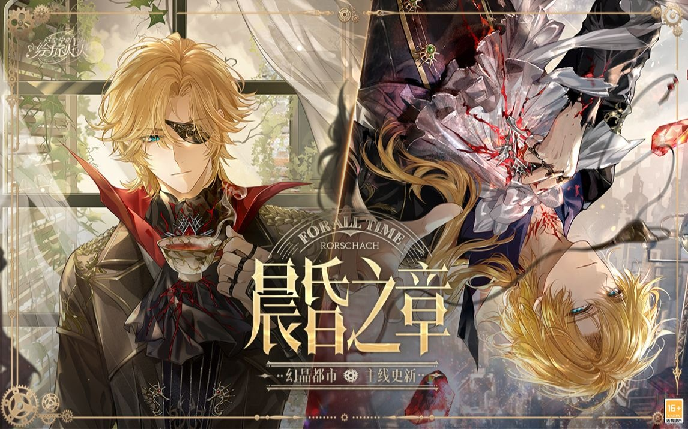



<!-- timeline 10-22 -->

[《时空中的绘旅人》幻晶都市·晨昏之章 | 主线PV首曝 ](https://www.bilibili.com/video/BV1pM41197s2/?spm_id_from=333.999.0.0&vd_source=683accdf4a366c372d15625bf59c99d7)  

vol.1【序章.列车】

我在不断行驶的列车上苏醒，我的衣着与车上其他人并无不同，仅在裙摆上有着零星的泥点和划痕，它们也许暗示着我曾遭遇追逃和战斗。

***你……拒绝这种世界?原来如此。是他派你来的?——艾因***

脑海中一片细密的痛感，却无法找到其缘由。这种近似于“失去”的感受只在知觉中停留了一瞬间，便烟消云散。*（这里难道是和艾因的通感？艾因得知我是“他”派来的，所以感到失落吗？）*

随身行李只有一个提包，包内只装着几颗手指大小的、闪烁着微光的石头——**幻晶**。唯一让人有些头绪的线索，是我手中紧紧握住的纸张——邀请函：**幻晶能源展览会，下午三时，中央街道……**

***“你大可以去看看这些人是怎么折磨这星球的。”——艾因***

vol.2【序章.展览会】

幻晶能源展览会，这是个关乎许多人财富和命运的展会，也包含前沿技术展示的部分。

一切话题都围绕幻晶展开，它是这座都市中最重要的矿产，与市民们的生活息息相关。

| *关于 “幻晶 ”的信息——来自展览会：* 自幻晶矿产的发现已过去八百年,八百年间，人类对它的探索旧渐深入。五百年前，幻晶被首次用作燃料。十五年前，蒸汽机的发明大幅提升了幻晶能源的利用率。此后，幻晶被广泛用于工业生产使科技与生产力一同突飞猛进。 如今，这座城市繁荣发展，获得了“幻晶都市”之名。这是人类文明的盛举，也是自然造物赐予的奇迹。将幻晶用作燃料和材料,也根据其在地底形成的地脉规划城市布局。也有观点认为，幻品来自于我们尚未发现的史前文明，若能参透其中的古老知识，便可以发现与现今截然不同的科技体系,引发魔法一般的奇迹。 有传闻，有些幻晶会让人陷入疯癫，或者长睡不醒。那正是因为他们过多接触了幻晶里浑浊的部分。也就是幻晶症。“说是幻晶用得多的地方会有人昏迷或者发疯……不过官方都已经辟谣了呀，说那些案子和幻晶没有关系……” |
| ------------------------------------------------------------ |

遇到罗夏，突然注意到我，并公然向大众提起我的身份！？

- 这位就是我跟您提到过的天才博士了。来自遥远的纳尼蔻勒,因为被小人污蔑才流落到这。她发现了幻晶的浑浊现象，却没人相信，只能用信件托我这个粗人代为炒作。博士的杰作——世上第一批能够精准操控人心的幻晶。

目前的疑点：
①艾因口中的“是他派你来的?”，这个“他”指的是谁？
②裙摆上的泥点和划痕，是谁在追杀我？
③我在这个世界的身份，到底是什么？
④罗夏的真实身份？为何他会称我为博士，难道他真的认识我？

<!-- endtimeline -->

