<iframe frameborder="no" border="0" marginwidth="0" marginheight="0" width=50% height=86 src="//music.163.com/outchain/player?type=2&id=41672490&auto=1&height=66"></iframe>

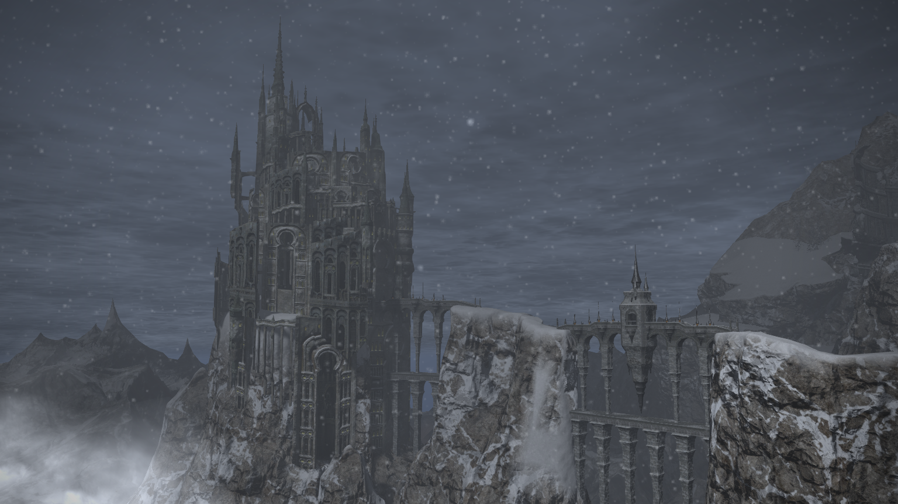

在阿巴拉提亚云海的深处，库尔札斯高地无尽的云雾之上，坐落着山城伊修加德。千年以来，伊修加德一直深陷于同龙族之间无止境的龙诗战争之中。而如今的伊修加德，正经历着从伊修加德正教统治的政教合一城邦，向共和国家发展的变革。

②

伊修加德信仰冰河与战争之神哈罗妮，哈罗妮是艾欧泽亚信仰的十二神之一，司掌冰河与战争，也是破坏神拉尔戈的女儿，大地神诺菲卡的敌人。尽管伊修加德正教的信徒们同样承认十二神中另外十一位守护神的神性，他们依然坚信其他守护神的力量远不及战女神哈罗妮。

伊修加德的旗帜被划分成四个部分的盾徽，象征着伊修加德四大家族的标志。依次代表着：红色蔷薇纹章-艾因哈特家族、金色警钟纹章-狄兰达尔家族、银色塔纹章-泽梅尔家族、红色独角兽纹章-福尔唐家族。盾徽顶部带翼的王冠则是代表教皇的统治。

伊修加德人非常看重荣誉和传统，血统在伊修加德人心中的地位尤其重要，人们都谨记着自己的家谱。而那些血统可以追溯到开国英雄的人，则享有更高的社会地位。对血统的重视，使得伊修加德社会形成了严格的等级制度，贵族和贱民在价值观和生活方式上都大相径庭。

千年以来，伊修加德一直由教皇「托尔丹七世」领导的伊修加德正教统治，为神权制。在教皇托尔丹七世去世之后，伊修加德正教的许多教义都面临着质疑和挑战，教皇之子艾默里克也开始进行深远的改革。在困扰伊修加德千年的邪龙尼德霍格死后，伊修加德重回和平，国家也由政教合一的神权制城邦，转变为两院制共和国。从此伊修加德的国家政策将由众议院和参议院共同决定。

伊修加德现在由贵族中选中的上议院议员，与平民中选出的下议院议员共同承担治理国家的重任。元首为前教皇托尔丹七世之子、现上议院议长——艾默里克。

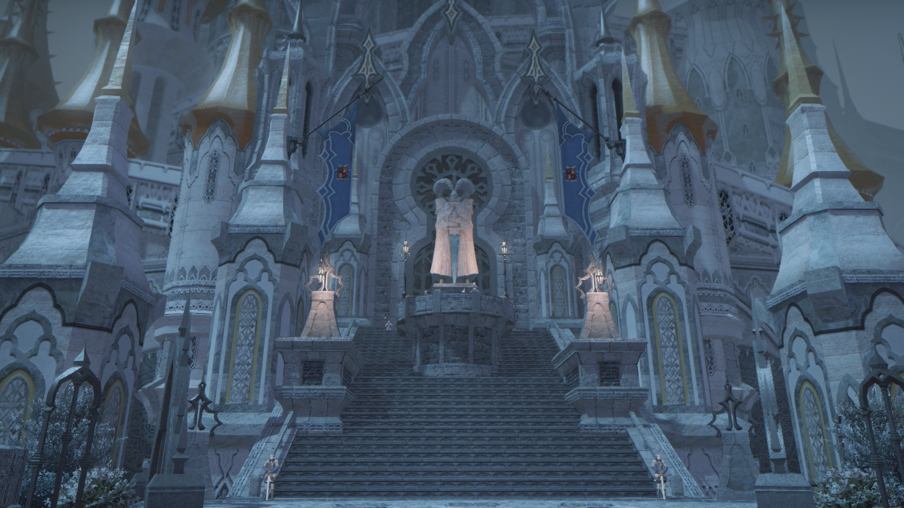

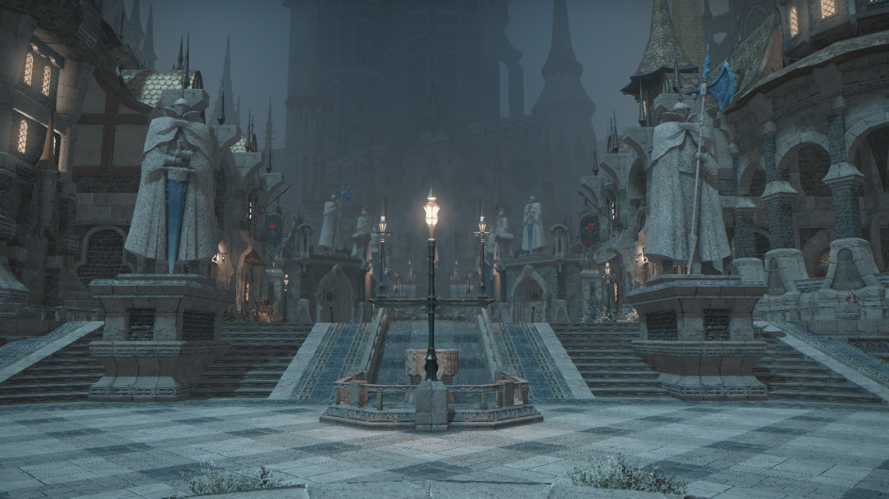

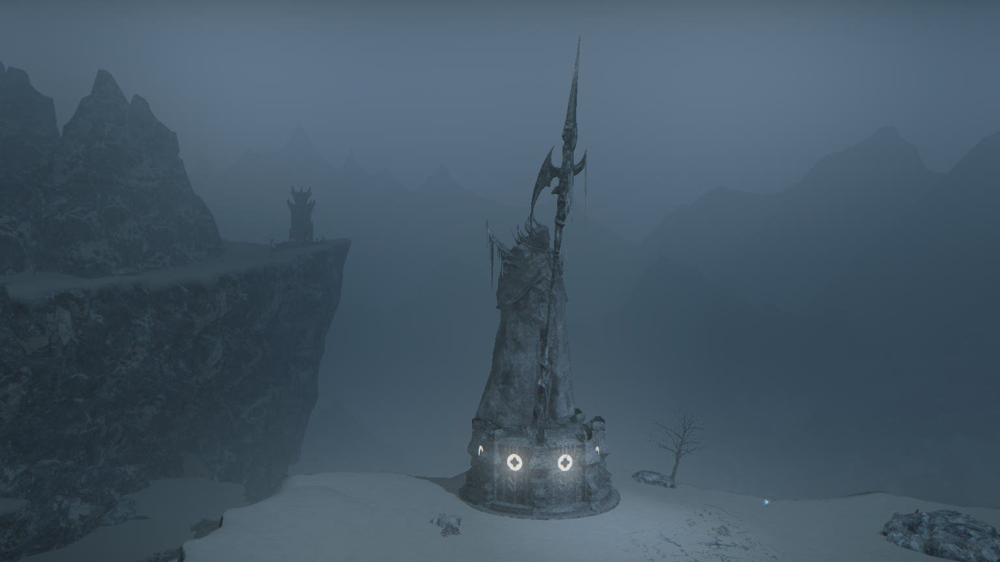

伊修加德教皇厅是伊修加德正教的总部，教廷政府的所在地，拥有教皇的宝座。教堂厅位于城市最高处，因此神职人员经常被称作「穹顶牧师」。

在伊修加德圣典的记载中，伊修加德的历史可以追溯到1000年前，初代国王托尔丹收到战女神哈罗妮的神谕，看到了精灵族的乐土。他向国民承诺，他将带领人民前往北方阿巴拉提亚云海深处的的神意之地。于是，收拾起仅有的行囊，乘上马车，伊修加德的先人们离开了黑衣森林，前往了库尔札斯高地。然而，当他们终于到达云海腹地的山谷时，邪龙尼德霍格突然出现并发起了猛烈的袭击。

国王托尔丹和他的十二名圆桌骑士站了出来迎战邪龙。经过了一番血战，国王被尼德霍格扔进峡谷杀害，大半圆桌骑士也殒命。最终托尔丹的儿子、十二圆桌骑士之一的哈尔德拉斯和剩下的四名骑士战胜了尼德霍格，并挖下了邪龙的一只龙眼，迫使邪龙撤退。

在这场惨烈的战斗后，托尔丹的人民们获得了短暂的和平，并且利用这段时间建立起了宏伟的城市——伊修加德。然而，哈尔德拉斯并不愿意继承王位，他戴上了蓝色的龙骑士战盔，成为第一任苍天之龙骑士，发誓将征讨所有威胁伊修加德人民的龙族。王位的空缺，迫使剩下的四名骑士建立了管理伊修加德的四大家族与伊修加德正教，从此开始了四大家族与教皇厅对伊修加德的统治。

为称颂初代苍天之龙骑士——哈尔德拉斯，女雕刻家佩瑟勒耗费晚年30余年的时间建造了巨大石像「征龙像」，其艺术技巧和历史价值之高，直到其建成后150余年的今天，依然无出其右。

 
但随着一步步揭开龙诗战争的真相，真实的历史却不是如伊修加德圣典中记载的那般。
 
在一千年前，当时的精灵族国王托尔丹一世觊觎龙眼中蕴含的的力量，与他的十二名骑士密谋袭击并且杀害了七天龙之一的诗龙拉塔托斯克，并分食了她的龙眼。由此托尔丹和十二骑士获得了远超凡人的力量。得知托尔丹的背叛行为之后，拉塔托斯克的哥哥尼德霍格怒不可遏，誓要用托尔丹和骑士团的性命告慰拉塔托斯克。战斗持续了七天七夜，托尔丹和半数骑士相继殒命。最终在托尔丹之子哈尔德拉斯的带领下，幸存的骑士们取得了胜利，并且夺得了尼德霍格的两颗龙眼。失去龙眼的尼德霍格被迫撤退。 在这场战斗之后，哈尔德拉斯放弃继承王位，决心继续讨伐龙族，以苍天之龙骑士的身份度过余生。还有一部分骑士耻于自己的罪行，放弃了骑士的身份，最终只剩下了四名骑士。他们决定与神职人员联手，建立一个新政府来统治伊修加德。同时，为了让人民能够继续同龙族战斗，他们为伊修加德编造了一个新的令人信服的历史。这四名骑士也成为了伊修加德的建国元勋。 

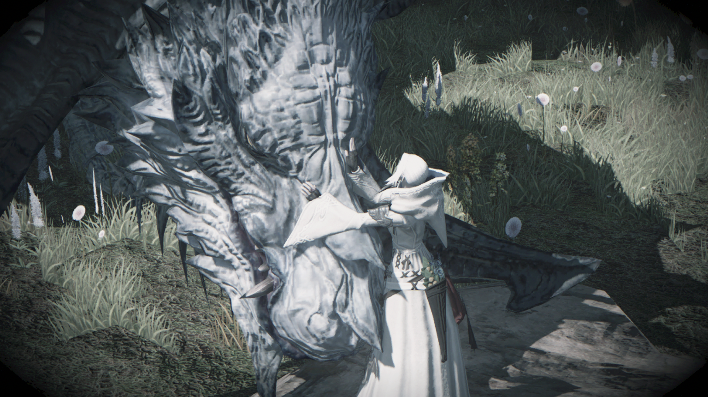

在伊修加德一直流传着一段跨越种族之爱的故事。

1200年前，精灵族人初次来到了库尔札斯之地，一开始，他们和龙族之间不断有小规模的摩擦发生。但是没过多久，有一位少女成为了两族之间交流的桥梁，她的名字叫希瓦。名叫希瓦的精灵族少女，爱上了七大天龙之一的赫拉斯瓦尔格，也因此在龙诗战争开始后的伊修加德圣典中被列为异端者。传说希瓦被龙族的远见和智慧深深迷住了，而龙族也被这名精灵族少女的坚定信念与同情心打动。然而赫拉斯瓦尔格深知，对于可以度过万年光阴的龙族来说，精灵族那不过百年的寿命太过短暂，这让圣龙十分绝望，也为他们的幸福蒙上了一层阴影。看到爱人如此悲伤，希瓦恳求赫拉斯瓦尔格吃掉自己，让自己的灵魂和以太永远陪伴着赫拉斯瓦尔格。最终，怀着沉重的心情，赫拉斯瓦尔格照着她说的做了。

他们凄惨的爱情成为了两族交好的象征，深受感动的两族放下了彼此的差异，共同建立起了希瓦所期望的社会。龙堡和翻云雾海的那些华丽建筑的遗迹，正是人类和龙族和谐相处的见证。然而，圣女希瓦为两族带来的和平仅仅持续了两百年，最终被觊觎龙眼的托尔丹一世和其下十二名龙骑士所打破，伊修加德与尼德霍格长达千年的龙诗战争爆发。

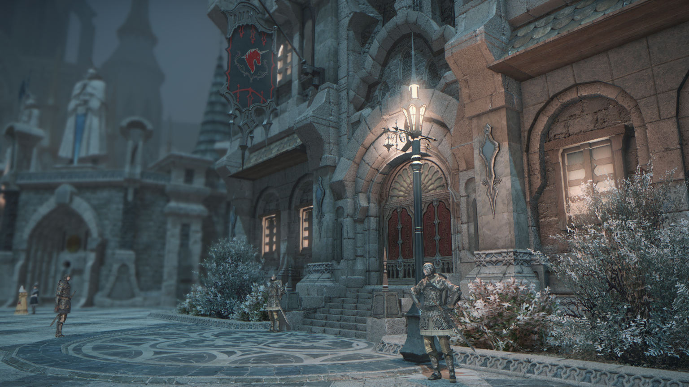

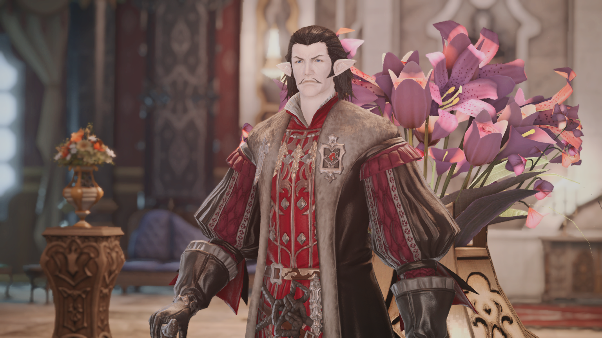

相对于位于城市低层、平民与生产所在地的伊修加德基础层，伊修加德砥柱层是出身高贵者的区域。伊修加德四大名门的庄园、各种宗教场所以及伊修加德正教教皇的宝座都位于砥柱层。伊修加德四大名门包括艾因哈特、狄兰达尔、泽梅尔、福尔唐。四大家族分别管辖着伊修加德的各个区域，伊修加德的国旗中四大家族的纹章也代表了四大家族相互合作、相互钳制的关系。

根据伊修加德圣典中记载的历史，在遥远的过去，四大家族是和国王托尔丹的儿子征龙将军哈尔德拉斯一同征讨邪龙尼德霍格的伟大骑士的后裔。虽然四大家族互相对立，尤其是艾因哈特家族与泽梅尔家族世代存在着冲突，但仍旧是守护伊修加德的同伴。

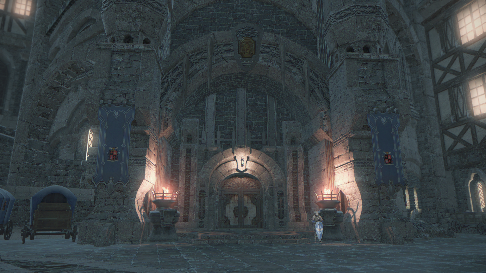

神殿骑士团总部是神殿骑士们的总部，也是神殿骑士团总骑士长艾默里克的办公所在地，龙骑士团也驻扎在这里。

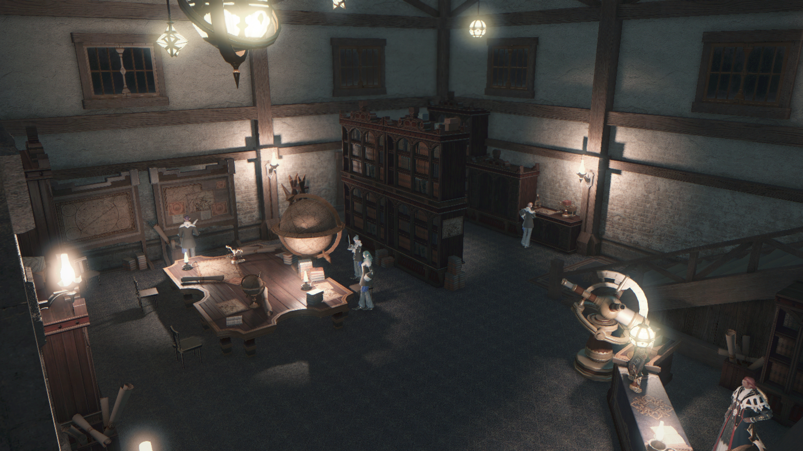

圣冈里奥尔占星院是通过观星来预测龙族动向的「占星学家」的聚集地。占星学家们为了提高预测的准确度，在这里不断对星辰的观测法进行研究和改良。而在这里研究得出的观测法将会在阿德内尔占星台进行实际观测以检验效果。这里虽是通过观星来预测龙族动向的地方，然而也可以学习到发源于知识之都萨雷安的正统占星术。若是有学习萨雷安式占星术的意愿，可以在这里得到指导。

根据圣冈里奥尔占星院的继承人与研究员雅内基纳尔所说，占星术的知识发源于萨雷安，是一种通过利用星辰之力发动治疗或强化魔法，使人们获得足以冲破命运桎梏之力的魔法体系。在传入皇都伊修加德后，被作为预测龙族动向的一项技术而发展应用，所以一般将使用伊修加德式占星术的人称为占星学家，而将使用萨雷安式占星术的人称为占星术士，以此来作为区分。

然而，伊修加德的占星术是一种「学术」，最重视的是理论的学习和天体的观测。相反，萨雷安的占星术则是一种「魔法体系」，为了驱使魔法，需要借助星辰的力量，施术者的个人能力是不可或缺的。即便如此，出身名门狄兰达尔家族的雅内基纳尔，一直在努力推广萨雷安的占星术，但却被伊修加德的贵族同僚们认为是白费力气，他们认为不能预测龙族动向的魔法根本毫无意义。

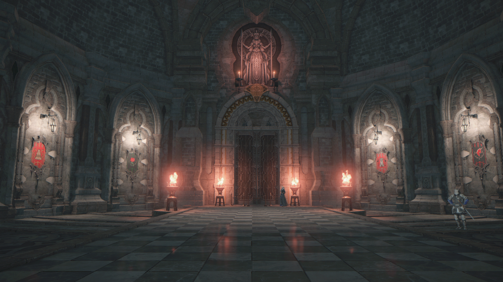

神圣裁判所是伊修加德宗教法庭的主要办公地。是在战神哈罗妮面前裁定人们罪孽的神圣之地，对被指控有异端邪说罪名的人的审判也在这里举行。

所谓「异端者」，就是具有反对正教者、将龙族视作同伴的投敌行为，这种行为在伊修加德被视作为异端重罪。此外，伊修加德还设立了「异端审问局」搜查机关，负责搜查的异端审问官，被赋予非常广泛的权利，一旦被认为有异端嫌疑而盯上，即使是上位贵族也难逃其手。另一方面，拥有强权作为后盾的异端审问官，在搜查过程中经常会使用各种蛮力与酷刑，因此在皇都民众中风评很不好。而在千年的龙诗战争画上句号后，异端审问局也终将被一同洗去。

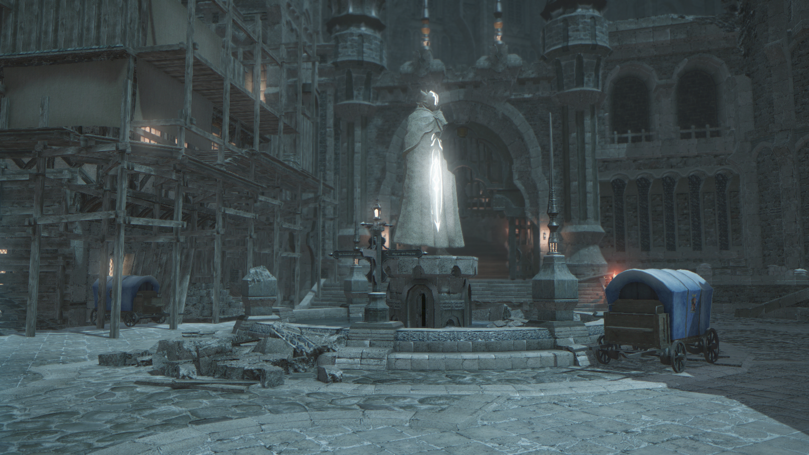

圣蕾内特广场位于基础层的西部，这里有一尊圣女蕾内特的雕像，伊修加德正教圣典的手抄本中记载了圣女蕾内特的生平。蕾内特曾作为一名龙骑士带着她的「穿心枪盖博尔格」去为她的爱人复仇，在向杀害自己恋人的龙族报仇后，蕾内特将长枪插在战场的山谷里，从此远离战争，遵从神的教诲，成为了一名扶贫济困的修女，帮助穷人与受压迫者，度过了清贫的一生，时刻都在奉献着爱。附近的清贫凯旋门就是为了纪念她的牺牲与贡献而建造的。

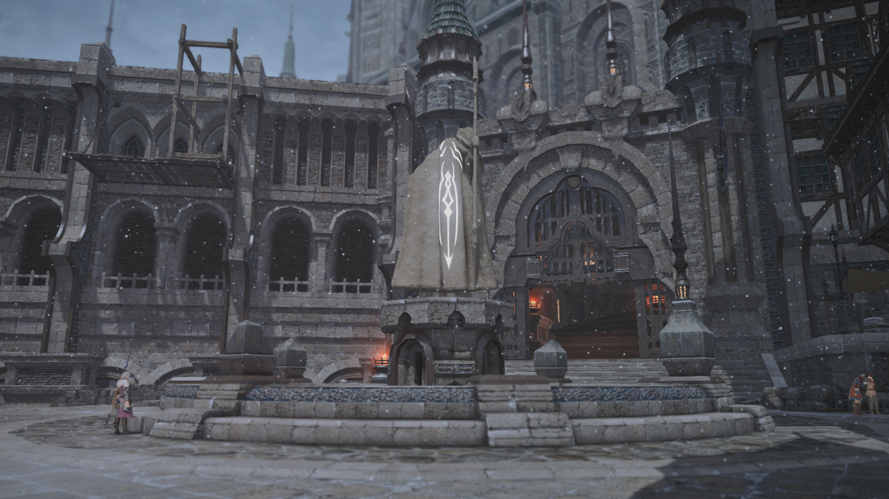

圣瓦勒鲁瓦扬广场位于基础层的东北部，这里有一尊圣瓦勒鲁瓦扬的石像。但是在飞龙的突袭中，以瓦勒鲁瓦扬为原型的雕像被毁坏了。

瓦勒鲁瓦扬曾是一名苍天之龙骑士，在数百年前击退了邪龙尼德霍格。后来，瓦勒鲁瓦扬为救援被巨龙群袭击的村庄而出击，并为搭救一个牧羊人挺身而出而战死。在第六星历817年，伊修加德教皇厅将战死的苍天之龙骑士瓦勒鲁瓦扬列为战神哈罗妮的圣徒。「苍天之龙骑士」在伊修加德家喻户晓，龙骑士是龙诗战争中的先锋队，而只有龙骑士中的精英才能获得「苍天之龙骑士」的称号。为了纪念曾经传说中的苍天之龙骑士圣瓦勒鲁瓦扬，在纪念日的那一天，神殿骑士团会为皇都的孩子们发放圣人草编织的头冠。

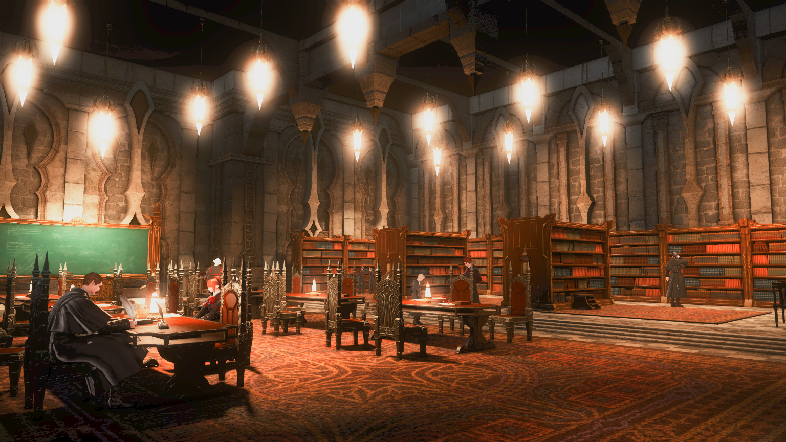

圣恩达利姆神学院是由伊修加德正教建设并运营的神学院，保存着圣座的圣经，并教育着未来的神职人员。以成为圣职者为目标的学生们在这里勤学苦读，其中除了贵族子弟之外，也有圣职者推荐的平民。学院教授的内容从基本的伊修加德正教的教诲开始，到极为复杂的教会法都有涉及。为了理解这些内容，需要习得文法、修辞学、理论学，还要学习算数、几何学、天文学、音乐，也可以学习魔法。另外最近新开设了萨雷安式占星术的科目。

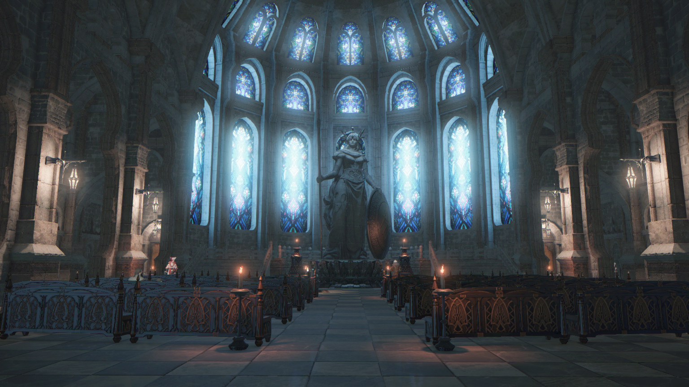

圣雷马诺大圣堂得名于伊修加德正教的第一任教皇，这座教堂是献给战争神哈罗妮的。圣恩达利姆神学院就在该场所内。

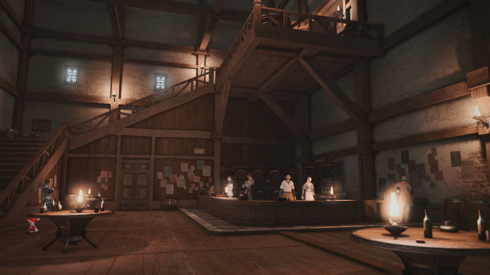

无人得知忘忧骑士亭是在何时建立的，这家酒馆经由一代又一代骑士之手传承下来，据称他们都是曾是在战场上负伤的士兵。作为传统，上一任店主在交接时会把那件镇店之宝一并托付给新任店主：一柄生锈的古剑，剑柄上刻着如下文字：「献给即将被世人遗忘的骑士们」。以驱除魔物为生的佣兵集团「百家兵团」也在这里运营。这里同时设有九霄云舍旅馆，据称这家廉价旅馆的老板吹嘘店内的床十分松软舒适，人们躺在上面会感觉仿佛睡在九霄云上一般。然而客人们在掏完腰包后很快发现床铺中填充的并不是鹅毛，而是坚硬的干草......

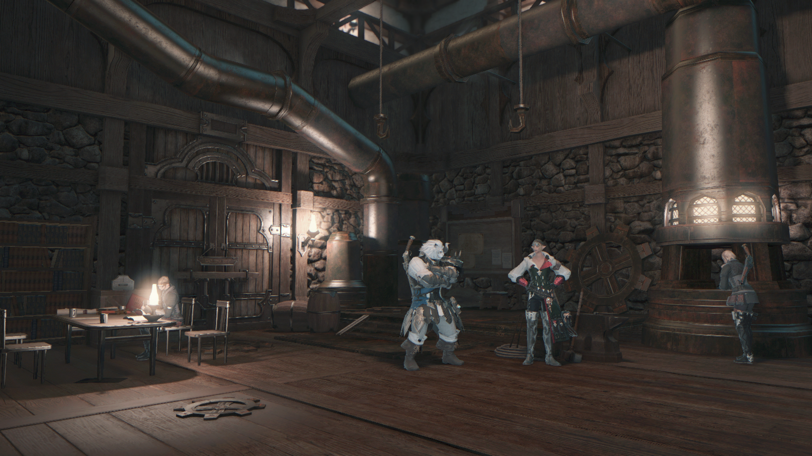

天钢机工房是艾因哈特家族拥有的一个工坊，主要用来开发和制造包括飞艇在内的机械来支援龙诗战争。人们通常认为伊修加德是一个保守的不积极追求科学进步的国家，然而恰恰相反，伊修加德对魔导技术的军事应用进行了大量研究和开发。此外，他们还与加隆德炼铁厂合作，改进现有的飞空艇设计，与加隆德炼铁厂在魔导技术的应用方面有深度合作。

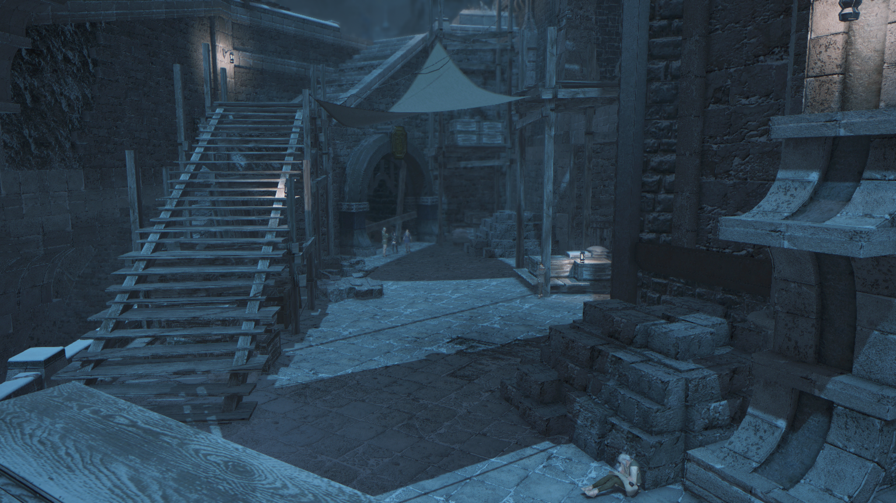

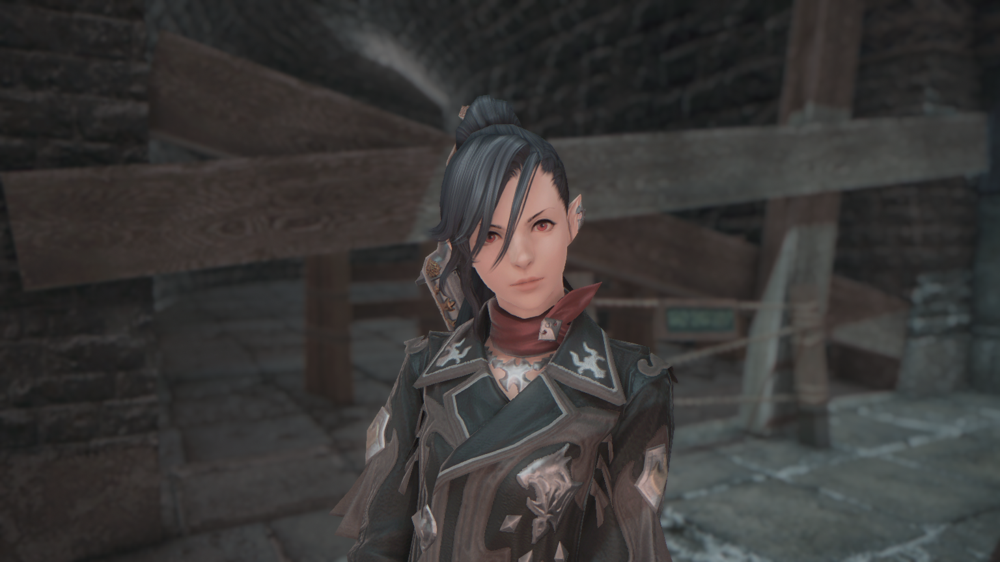

云雾街是基础层中，出身低微者居住的街区，它主要由之前龙族袭击造成的废墟建造而成。这里的生活条件很差，缺乏基本的必需品，且过于接近云廊，使得这片地区时刻面临着遭遇龙族袭击的威胁。希尔达·韦尔曾是云雾街反抗组织的领导人，是一位性情直爽的大姐头，称号为长耳。是伊修加德的精灵族贵族和人族平民女性的混血儿，现领导伊修加德平民警备团。

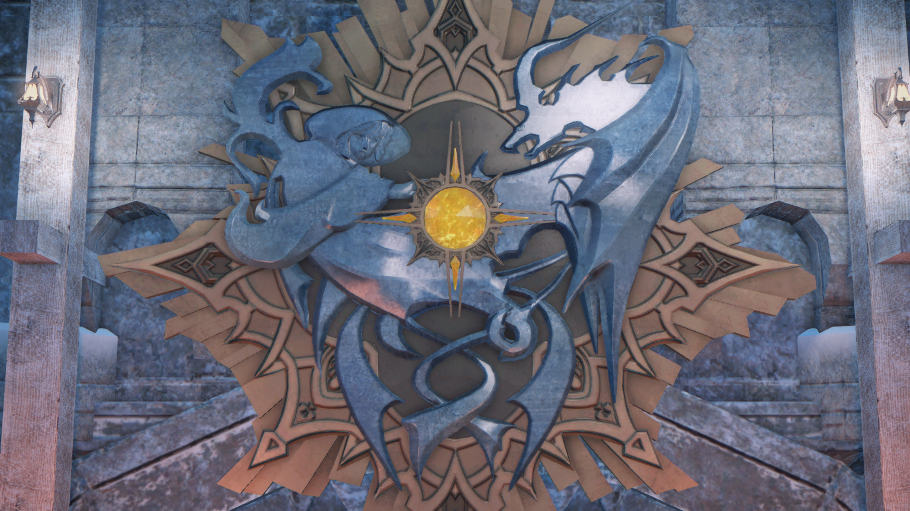

「   **延续千年的战争龙诗在云海中消散**

​       **新的龙诗将歌颂和平与融合的新希望**    」

&emsp;&emsp;&emsp;&emsp;&emsp;&emsp;&emsp;&emsp;&emsp;&emsp;&emsp;&emsp;&emsp;&emsp;&emsp;   &emsp;——《苍穹之禁城》回忆录：最终章 绝命怒嚎    **埃德蒙·德·福尔唐**

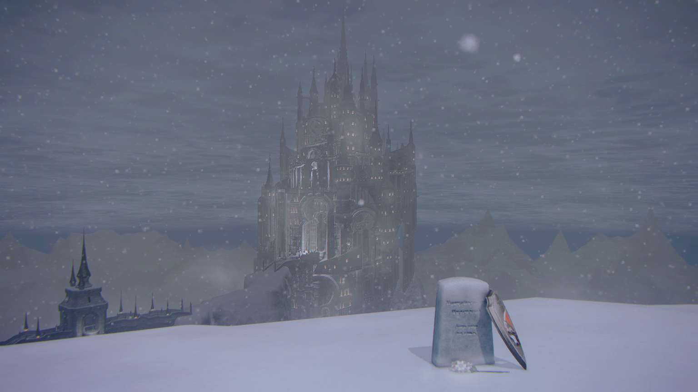

「     **一名骑士理应尽到自己的职责。**
        **而这个职责就是为了人民和朋友而战。**    」

