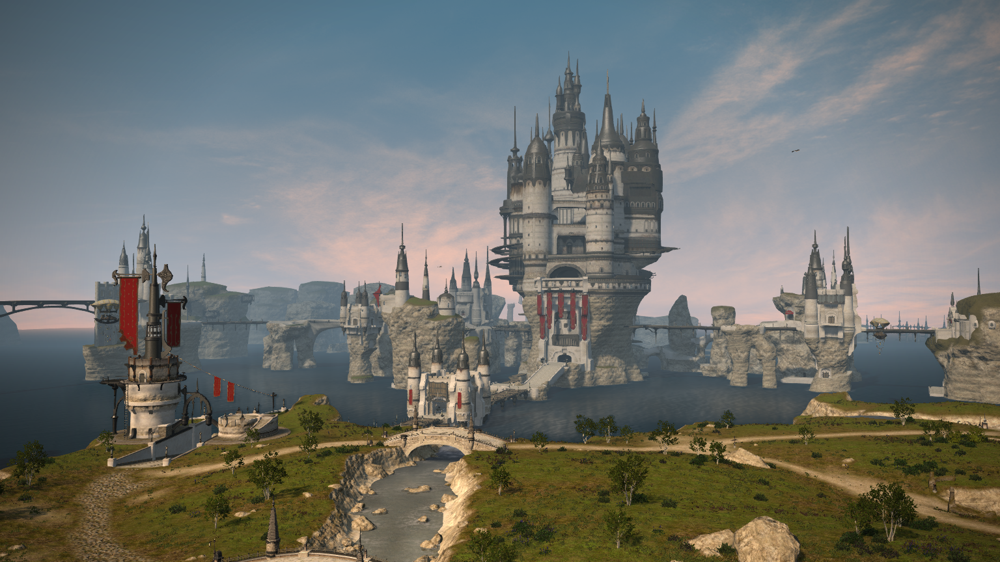
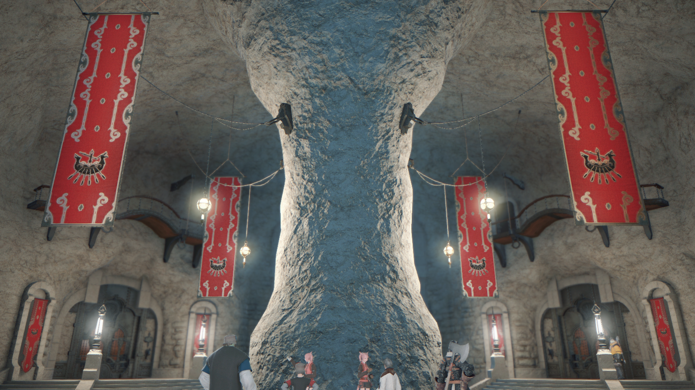

利姆萨·罗敏萨位于罗塔诺海上的威尔布兰德岛南部，统辖拉诺西亚地区，是建立在石柱和暗礁之上的「海洋之都」。石柱、暗礁之间以铁桥连接，国民们经由长长的铁桥在城市中穿梭，在海上繁荣发展，并由此获得「海洋女神面纱」这一称号。

利姆萨·罗敏萨盛行对女神「利姆莱茵」的信仰。利姆莱茵是艾欧泽亚信仰的十二神之一，司掌海洋与航海，同时也是利姆萨·罗敏萨城邦的守护神。传说在很久很久以前，世界还只是一片焦土，只有火焰与岩石。领航者利姆莱茵创造了一条巨蛇，巨蛇喷出水柱，艾欧泽亚的海洋由此而来。而这条巨蛇永无止息，甚至有将所有陆地淹没之势，于是利姆莱茵将其封印在一座名叫燕尾游石的浮岛上。而当这只大海蛇醒来之时，利姆萨·罗敏萨的命运又将如何呢......

利姆萨·罗敏萨的国旗被称为「龙船旗」。旗帜上的深黑色长船为一艘海盗船，象征着建国者「北洋之民」海盗们统治北部海域的往事。旗帜的深红底色则代表着为国捐躯的同伴们的热血，展现着海盗建国的那段鲜血历史。

   利姆萨·罗敏萨的现任提督为「梅尔维布·布鲁菲斯维因」，同时担任大国防联军黑涡团的最高司令官。由于 意识到需要强力的盟友去面对加雷马帝国的侵略威胁，不能再与其他艾欧泽亚国家对立，梅尔维布提督曾颁布一条令 人震惊的法令：全面禁止作为城邦经济支柱的海盗行为。而说起海洋之都的政体，根据前提督阿伽特扎尔建立的「海 魂制度」中，每隔七年举行一次「海魂竞赛」，强大的海盗团之间互相竞争，最终胜利方的率领者将得到名为提督的 首长之位。而现任提督梅尔维布则是白银之沙海盗团的首领。

