利姆萨·罗敏萨位于罗塔诺海上的威尔布兰德岛南部，统辖拉诺西亚地区，是建立在石柱和暗礁之上的「海洋之都」。石柱、暗礁之间以铁桥连接，国民们经由长长的铁桥在城市中穿梭，在海上繁荣发展，城邦并由此获得「海洋女神面纱」这一称号。

利姆萨·罗敏萨盛行对女神「利姆莱茵」的信仰。利姆莱茵是艾欧泽亚信仰的十二神之一，司掌海洋与航海，同时也是利姆萨·罗敏萨城邦的守护神。传说在很久很久以前，世界还只是一片焦土，只有火焰与岩石。领航者利姆莱茵创造了一条巨蛇，巨蛇喷出水柱，艾欧泽亚的海洋由此而来。而这条巨蛇永无止息，甚至有将所有陆地淹没之势，于是利姆莱茵将其封印在一座名叫燕尾游石的浮岛上。据说如果这只大海蛇醒来，利姆萨·罗敏萨将会沉入海底。因此，黑涡团也一直遵从着「直至大海吞噬一切」的箴言，为对抗蛮神和加雷马帝国、战胜灵灾，直到生命的最后一刻，仍要竭尽全力、恪尽职守，处在战斗的最前沿。

利姆萨·罗敏萨的国旗被称为「龙船旗」。旗帜上的深黑色长船为一艘海盗船，象征着建国者「北洋之民」海盗们残暴统治北部海域的往事。旗帜的深红底色则代表着为国捐躯的同伴们的热血，展现着海盗建国的那段鲜血历史。在过去的历史中，北洋之民无法忍受暴君的统治，奋起反抗失败之后，他们乘坐加拉迪翁号从北洋深处的原初岛起航，向着未知的大海追寻自由的新天地。一年后搁浅在威尔布兰德岛南岸，并开始探索这座新岛屿，他们将这座岛的南岸地区，以搁浅前两天刚去世的一位航海员名字缩写命名为拉诺西亚。但与原住民「地灵族」的几次交锋之后，意识到内陆地区居住的危险性，最后返回搁浅在威尔布兰德岛南岸的加拉迪翁号，并以废船为中心，搭建了从船上到周围小岛及海湾各处裸露暗礁的桥梁，自此海上城市利姆萨·罗敏萨诞生。

利姆萨·罗敏萨的现任提督为「梅尔维布·布鲁菲斯维因」，同时也是大国防联军黑涡团的最高司令官。由于意识到需要强力的盟友去面对加雷马帝国的侵略威胁，不能再与其他艾欧泽亚国家对立，梅尔维布提督颁布了一条令人震惊的法令：全面禁止作为城邦经济支柱的海盗行为。而说起海洋之都的政体，根据前提督阿伽特扎尔建立的「海魂制度」中，每隔七年举行一次「海魂竞赛」，强大的海盗团之间互相竞争，最终胜利方的率领者将得到名为提督的 首长之位。现任提督梅尔维布则是白银之沙海盗团的首领。

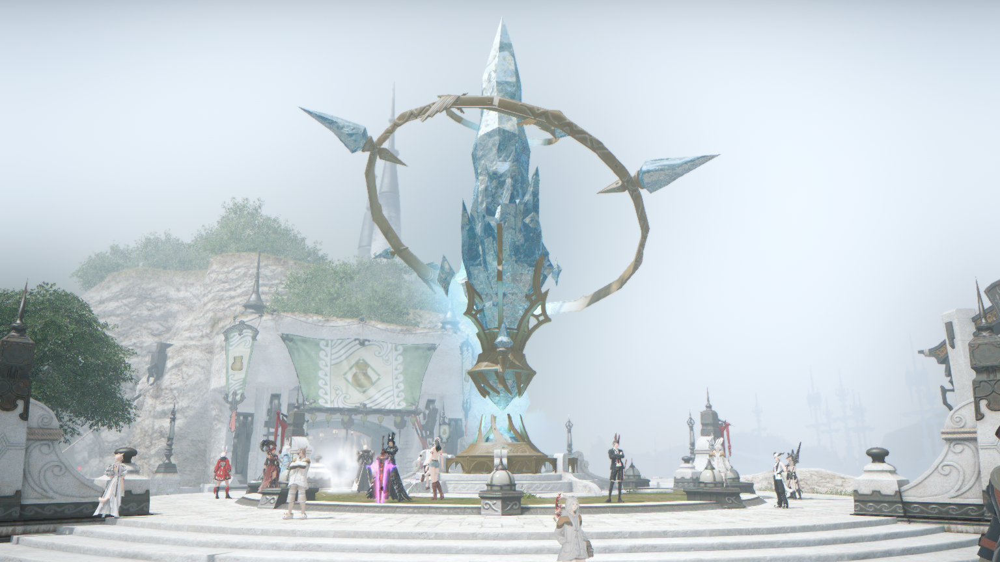

八分仪的发明极大地促进了航海技术的发展，利姆萨·罗敏萨的人们为了纪念八分仪的发明者乔凡尼·诺诺而修建了「八分仪广场」。广场中央矗立着第七灵灾之后重新修建的以太之光，同时这里还作为交通要道，以及市民聚集碰头的地方。布鲁盖尔商会也位在此处。

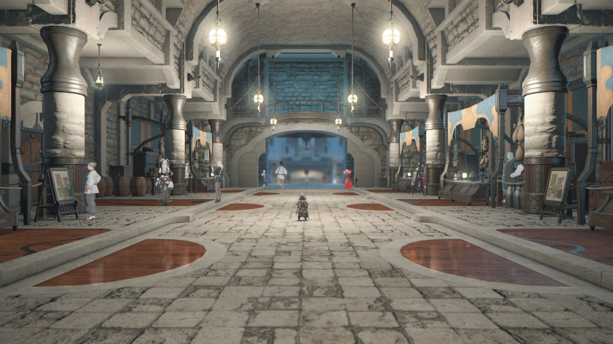

顺着八分仪广场往里走，便是商人们贩卖货物所在的「国际商贩路」。这里除了来自异国的商人之外，还有哥布林族，卢恩人族等蛮族的小贩。最近，甚至出现了来自于西方新大陆的辉鳞人族。

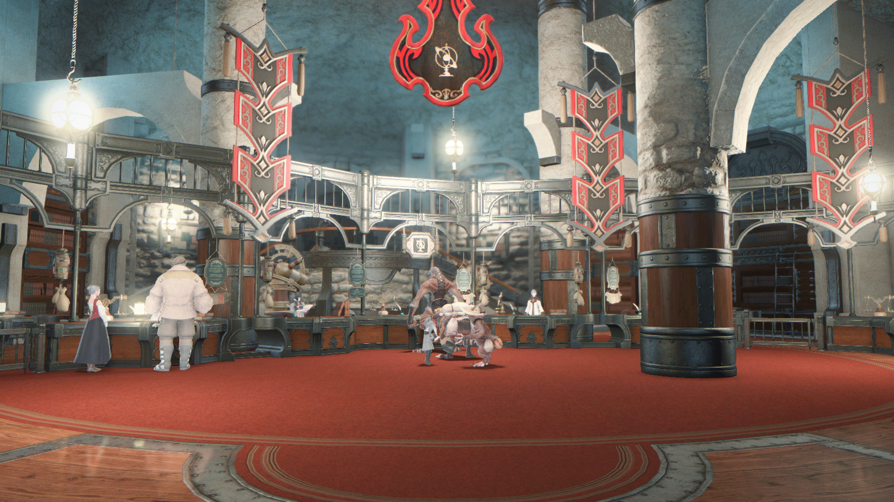

「梅尔凡海关」是对所有进港船只，以及卸下的货物、登陆的船员和乘客进行检查，并对其征收关税的机关。由当时的提督梅尔凡建立，并定下了「即使提督换代，海关也只有一个」的原则，由此该海关与利姆萨·罗敏萨交易服务至今已有大约五百多年。且因为秘术师们精通货物的审查和税款计算，所以这里也一并设立了秘术师行会。

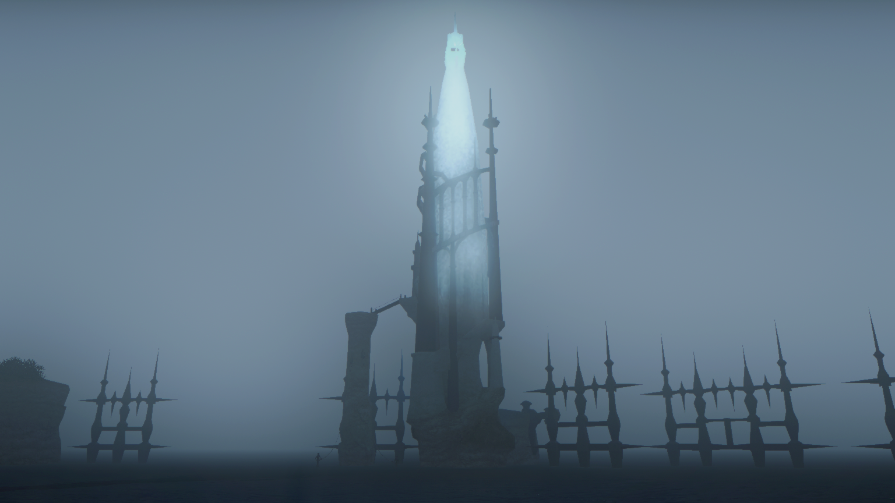

「北极星灯塔」是代替北极星指引船只安全归港的白色灯塔，它历经岁月风霜，建立在岩礁之上。纳尔迪克＆威米利作坊负责对它进行维护。为了安全起见，只有作坊的雇员才能进入。也有传闻说塔上的光是妖异爆弹怪的火焰。

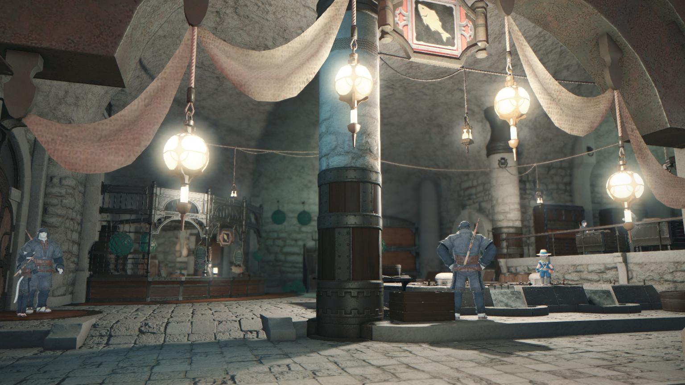

「网仓」是利姆萨·罗敏萨内规模最大的渔业组织，正式名称是「瓦瓦拉哥网组」，来自捕鱼人行会会长瓦瓦拉哥的名字。然而，市民们似乎更喜欢「网仓」这个称呼。

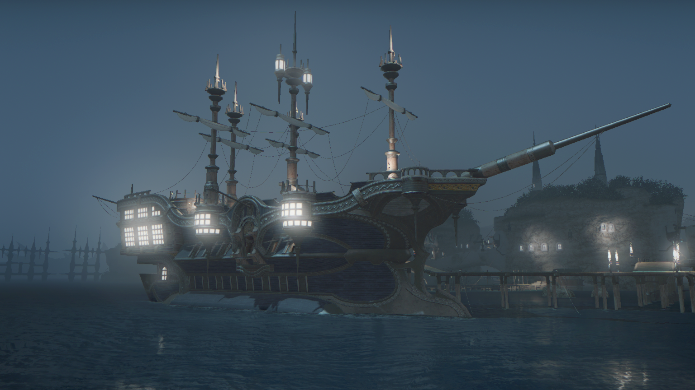

在「网仓」的右边看去，可以看见一艘巨大的帆船。帆船名为阿斯塔利西亚号，是三大海盗团之首「断罪党」所拥有的大型帆船。不过，虽然表面上对外宣称是一艘外国籍商船，但其实每个人都心知肚明，它的拥有者实则是断罪党的首领——「独眼」希尔菲厄。阿斯塔利西亚号内部是各派海盗的社交场所，城邦中的许多海盗也会在这里招募同伙。

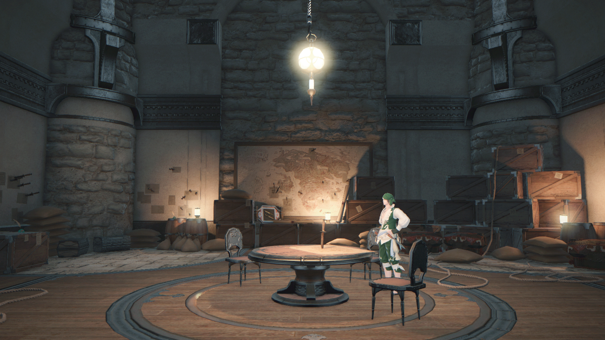

在「网仓」的左边看去，有一座民间商会「雪绒花商会」的仓库。表面上看起来就是一座独立商会的仓库，但事实上，这里驻扎着维护海盗「无法者之法」的一群人——「双剑师行会」。

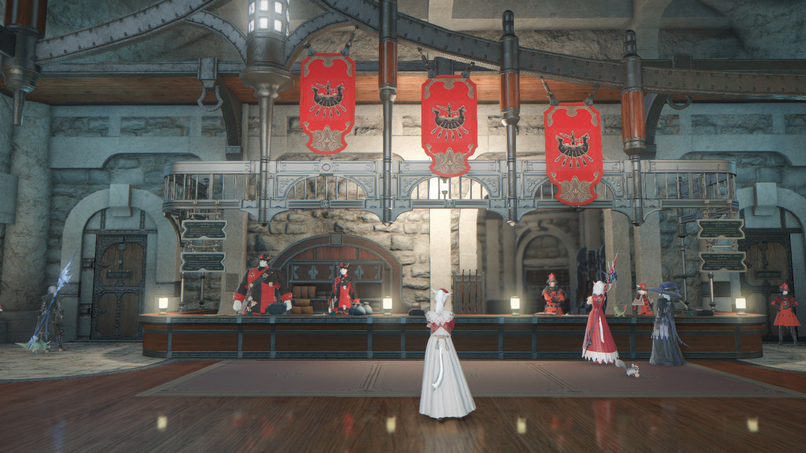

「黑涡军令部」在第六灵灾后，将大国防联军的总部移到此处。大国防联军是各城邦面临危机时设立的军事组织，组织内的地位以军衔来表示。黑涡团则是利姆萨·罗敏萨的官方军事组织，三大大国防联军之一。

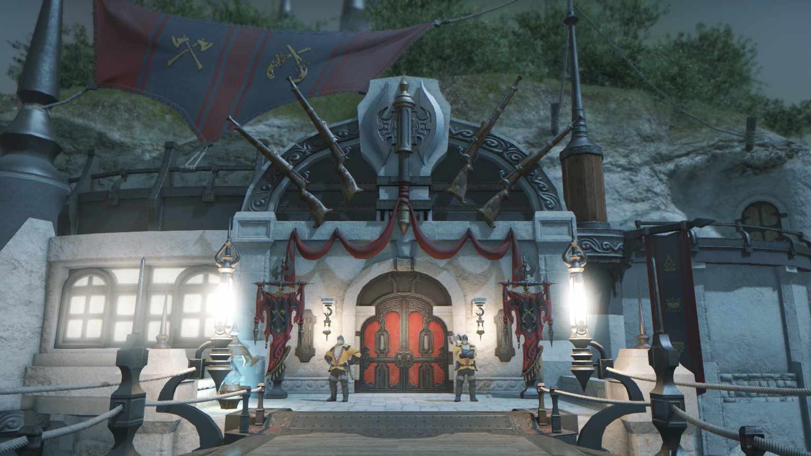

「珊瑚塔」是坐落于利姆萨·罗敏萨的港口之上的监视瞭望塔，以前是梭鱼骑士团的总部。如今，这座瞭望塔则是黄衫队的指挥基地以及斧术师行会的训练场所。黄衫队是黑涡团的步兵队，负责罗敏萨的领土安全以及保卫周边海岸。

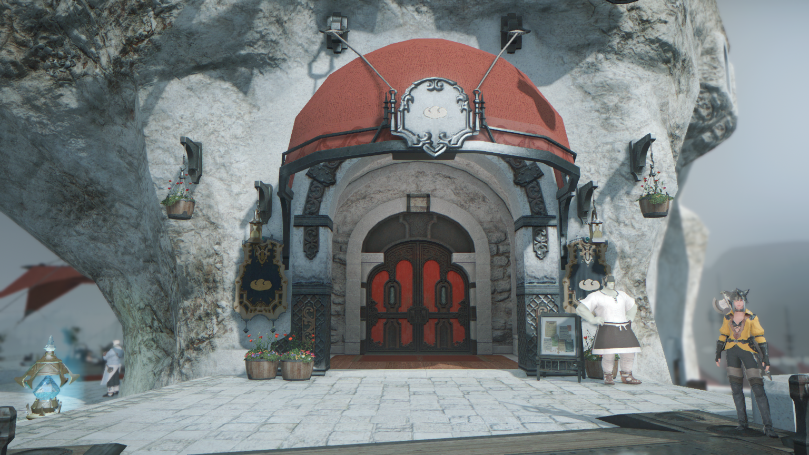

「俾斯麦餐厅」征集了世界各地的菜谱，可为来自五湖四海的食客们提供各地的珍馐佳肴，是整个艾欧泽亚首屈一指的头等餐厅。来到此处的客人都会像吞噬一切的白鲸那般，以风卷残云之势，将所有端上来的食物一扫而空。

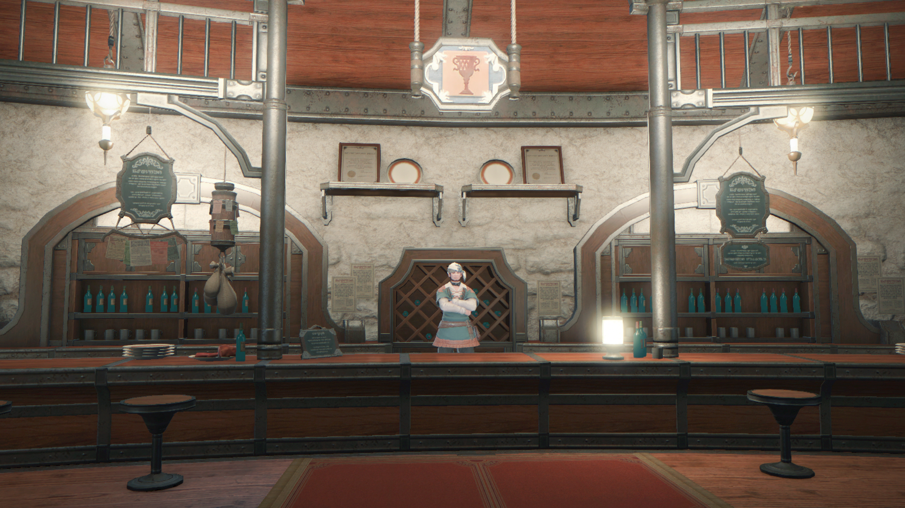

「沉溺海豚亭」这座酒馆占据了后桅塔整整一层。佣兵出身的巴德龙在这里设立了冒险者行会之后，酒馆也开始对外经营，吸引了来自各行各业的顾客，而在此之前，只有水手和海盗常来此地。当然，令沉溺海豚亭引以为傲的是他们物美价廉的酒和食物，并以拉诺西亚吐司闻名。

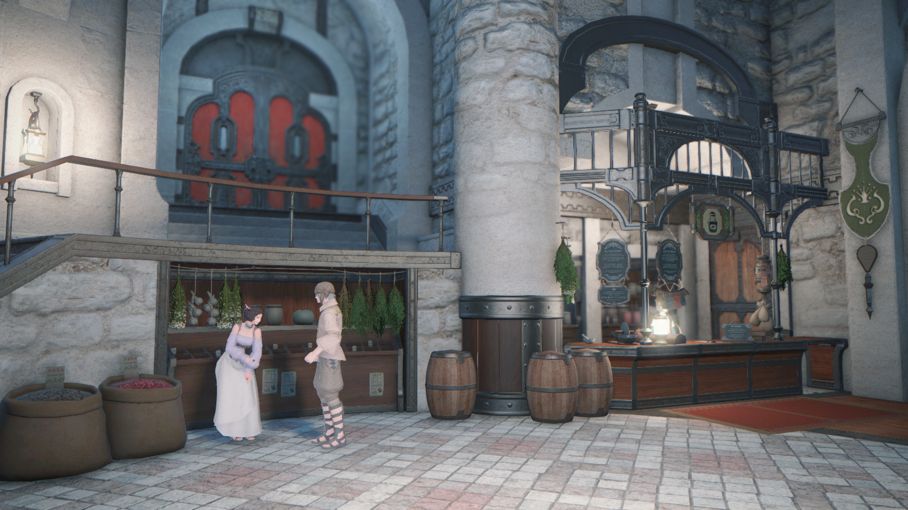

「七贤堂」是负责买卖香料和配料的商店。这里的交易包罗万象，从香料调料、蔬菜，以及来自遥远地区的异域配料应有尽有，来光顾的多为烹调师。七贤堂在接待烹调师们的同时，也会为百鬼夜行的交易服务，百鬼夜行的许多战利品就会陈列在货架上等待出售。

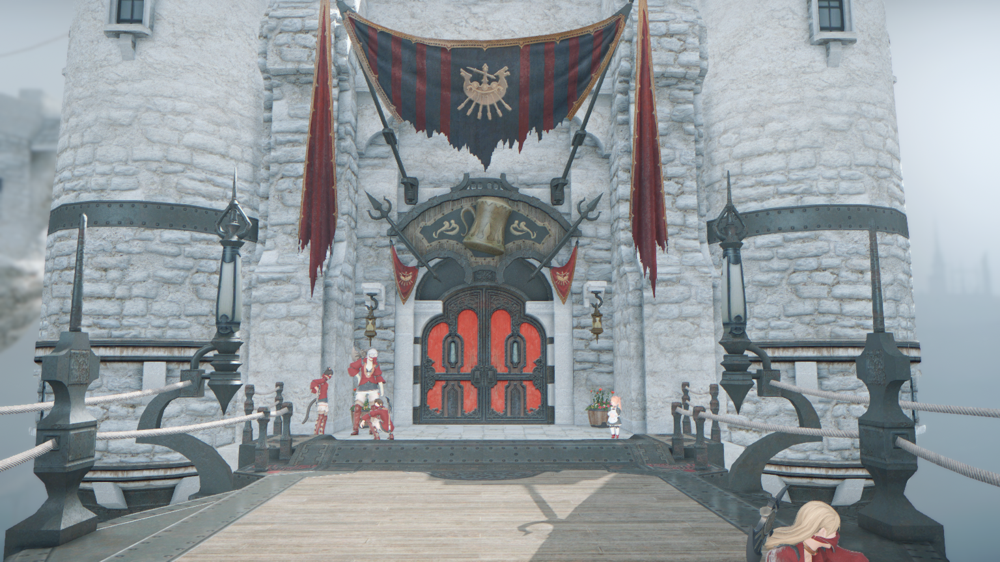

「永远少女亭」是红血圣女团所创建的酒馆。红血圣女团是利姆萨·罗敏萨三大海盗团之一，成员大部分为女性。最初是为了来到港口的船员提供服务的，而现在因其食物酒水逐渐积累美誉，市民和冒险者也乐意来到此用餐。红血圣女团的首领罗丝温最为注重海盗的传统，认为海盗不应被任何事物所束缚，要自由地生存。

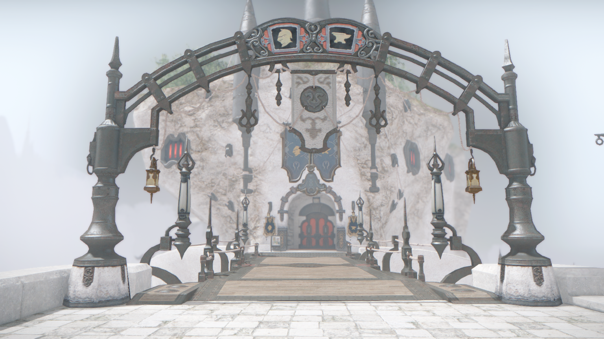

「纳尔迪克＆威米利作坊」是由传奇铁匠纳尔迪克和著名的造船匠威米利建立的作坊。现在他们利用在制造船舰时学到的板金加工经验，也开始制造盔甲。现在有造船部、火器部等多个部门。锻铁匠行会和铸甲匠行会也位于此处。

