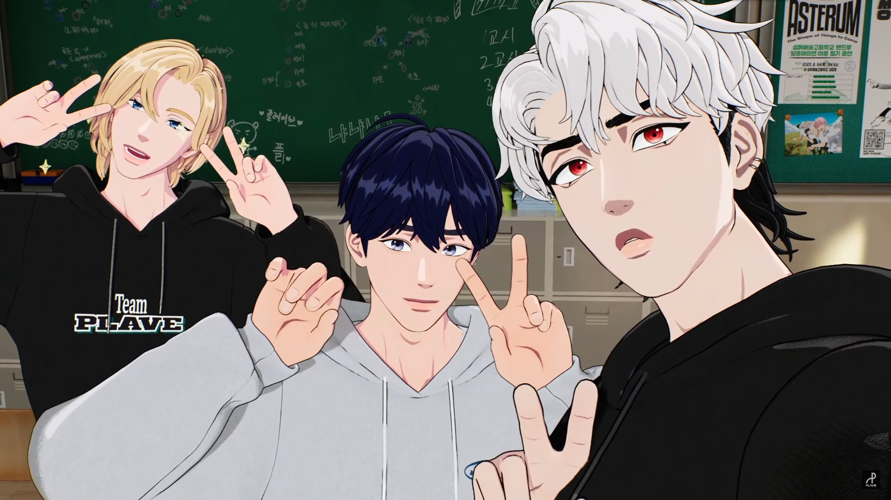
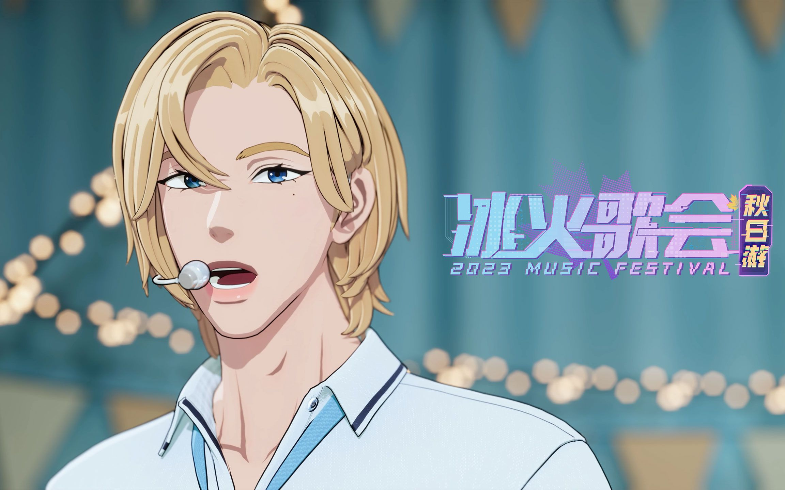



<!-- timeline 10-05 -->

今晚是制作人z~直播在线制作logo song，不愧是制作人line~尤其是虎子的绝对音感！😉

不得不提的是，今晚的直播肉眼可见的来了很多新PLLI，弹幕跳得好快，根本看不过来，看来冰火歌会还是起到了一些作用hhh

然后有一个点超好笑，就是艺俊说自己订阅了其他成员的泡泡，然后吐槽说成员的泡泡经常发“亲爱的”、“我爱你”等等这些腻歪的情话hhh

真是五十俊笑百步虎哈哈哈，明明艺俊在泡泡也经常这样😂只能说你们三媚粉程度真是不相上下

<!-- endtimeline -->

<!-- timeline 10-04 -->

今晚是PLAVE首次参加冰火歌会的舞台放送！PLLI们真的好热情，一直在弹幕应援还有刷礼物sc，甚至还有富婆姐姐刷了三艘宇宙大飞船，排面有了hhh

场景的建模也很用心，看起来很高级，五个人的生唱也是很真实很好听kkk不得不再感叹一句：面捕真的太厉害了！今直充啊今直充

中文自我介绍环节也很有趣！艺俊和河玟的中文听起来很标准，然后诺亚斑比虎子的听起来像是烤羊肉串的dbq😂

而且真的难以想象在限韩令下，很少有韩团可以像PLAVE一样在中国大陆有这么多的活动，又是CICF漫展，又是冰火歌会的，难道因为虚拟偶像的特质吗？

[【冰火歌会】PLAVE《第六个夏天》舞台纯享 | 4K超清](https://www.bilibili.com/video/BV1dN4y1o7at/?spm_id_from=333.337.search-card.all.click&vd_source=683accdf4a366c372d15625bf59c99d7)

<!-- endtimeline -->

<!-- timeline 10-03 -->

韩诺亚
小时候听别人介绍说有位歌唱得很好的朋友。 初次见面虽然有点尴尬，但因为"歌"这个共同点，当天就变亲近了！ 之后没过多久，我被诺亚邀请到他非常小的练歌室兼工作室。 我们各自分享最近在练习的歌曲和正在创作的音乐，就变得更加亲近了。 其实我也没有太多朋友，能够认识有共同话题的朋友觉得非常高兴。 之后有了参加Vlast选秀的机会，作为第一个练习生进入了公司，在独自练习的途中觉得.. 觉得如果和诺亚组团，应该能幸福地唱歌吧。 所以就这样kk 问了想不想一起。 我也不太清楚那家伙当时是以什麽样的心情决定加入的,,hh 感谢他只是因为相信我就和我一起，我也很依赖他。 大概就是命运吧💜💙

蔡丰玖
回想起第一次见到斑比的那天。在公司会议室第一次和斑比见面的那天，互相向对方尴尬地打招呼，听到以"成员"来做介绍的瞬间，心情很微妙hh 我记得当时只是简单地问了一下吃饭了吗，隔着银虎懵懂地观察著周边的人的视线！（旁边的诺亚也一样kk）和代表聊天后，在公司电梯前问了电话号码。 当时我把他的名字保存为"蔡斑比nim"，银虎把我们加到聊天群群了！ 因为我和斑比不是说平语，所以用了很长时间像"斑比nim"或"斑比先生"这样的尊称kkk 啊，还有被斑比感动的回忆。 在还有一名成员空缺的时候（在见到河玟之前），为了选择最后一名成员，我们见了很多其他的外星人。 当时斑比和我和诺亚还是很尴尬的，但是外星人会议的时候一定不会缺席。 即使是在还没完备的状态，在乱七八糟的位置上，他用那炯炯有神的眼睛，总是主动参与的样子，真的让我很感激... 让我产生了"作为成员团结一致原来是这样的心情啊"这种想法。现在我是斑比的别名制造担当💗💙

都银虎
我记得是在寒冷的冬天第一次见到银虎。 第一次见到银虎的时候感受只有一个，感觉很端正和有礼貌啊~hh 事实上我在人生中没有听过"大哥！"这种称呼的，银虎从第一次见面开始就一直"艺俊大哥！ "这样称呼我。 很可爱吧？kk 所以我也像大哥一样！ 想多照顾他，想多向他问好。 记得我们小时候相遇后，心裡都想给对方送点什麽，然后互相送了杯面套餐礼券hh（现在能够给银虎买更好吃的东西，觉得很幸福hh）第一次见面的那天，银虎给我听了一首他的自作曲，嗯...怎么说呢。我只能发出呜哇.. 这样的声音。 首先想到的是，啊，如果和他变亲近的话，在音乐方面应该会有很多值得我学习的地方。 从那时候开始我就变得有点缠人了kk 但银虎他也不讨厌，关系变得更亲近了。就这样，去年猛地！和他提出了加入PLAVE的提议hh 记得当时我在电话里小心翼翼地问了，当时银虎也是"大哥~大哥这样的话..当然要加入了！" 这样回答我了。对我来说银虎的存在是福星啊福星❤💙，现在也从银虎那里学习了很多😊

柳河玟
河玟真的很珍贵。在威廉代表和成员们全部在场的场合第一次见到了河玟。 对河玟的初印象就是"微妙"。 可能是因为全部成员都在场，所以才形成了那种微妙的氛围，但抛开那种氛围不说，河玟这个人本身,,hh该怎麽说呢。 黑色的头髮从外形上感受到相当大的气场？有种好像得通过威廉代表才能跟他传话的感觉。 全部人第一次一起吃饭的时候，就,,真的只吃了饭！kk 吃完饭大家分别的时候，因为我偶然和河玟的路线有重叠，聊了五分钟左右。 我还记得当时说的话，他说对舞蹈和身体真的很有自信，如果大家能相信并交付给他那就好了。 但，他这话的语气是，啊，原来这位叫河玟的朋友并不是木讷和阴沉的人啊。 我立刻想到如果变得亲近的话，还有河玟如果真的加入了我们团队的话，他应该会成为成员中最热情的人吧。 
如果再说一下遇见河玟之前的故事的话，我们成员们和公司都觉得一定需要河玟。 我们都清楚4个人的PLAVE无论从实力还是团队的气氛上都无法做到完美。 听说河玟收到加入PLAVE的提议后苦恼了很久，但我们觉得不能错过！ 不知道诺亚作为代表给河玟打了几周的电话hh，经过努力不懈的说服，我们终于被河玟选中了，现在和忙内on top的河玟组成了yeline!🐈‍⬛🐬
河玟的妈妈爸爸！ 感谢把我们河玟养育得这麽帅气！ 希望下次还有机会给您们打电话。 祝您们永远健康！ 南艺俊上🖤💙
————

是艺俊在泡泡写的对四位成员的初印象！真的是很真诚很可爱的五人😢对我来说，PLAVE五人之中谁都是无法被替代的，都是独一无二的存在

今年最幸运的事情，莫过于能够遇见PLAVE😭PLAVE&PLLI以后也要一直走下去！

<!-- endtimeline -->

<!-- timeline 09-16 -->

For Bamby：

首先，很感谢你们能来到中国，也很感谢你们能在哔哩哔哩同步直播！你们的每一场直播我都有看，最近我也在自学韩语，希望以后看你们的直播可以不再依赖不靠谱的机翻kkkkk

也许是因为我和你的MBTI一样，初次看你们直播的时候，五人里我第一眼喜欢上的人就是你。你是那样的与众不同，可爱美丽的外表下是有趣且自由的灵魂。但是，我知道这个人格类型有时精神内耗会很严重，希望只是我多虑，希望你没有这样的困扰，真心的希望你能快乐，一直做自由奔跑的小鹿，尽情地做你热爱的事，PLLI会一直支持你们，爱着你们，陪伴你们走下去。自从与你相遇之后，不知不觉间，粉色已然成为我最喜欢的颜色，最常喝的奶茶是蜜桃四季春，最喜欢的水果是甜甜的水蜜桃~

虽然是虚拟偶像，但在我的心里，你们的存在比任何人都要真实。我很喜欢Ditto这首歌，不知你是否同感，感觉我就像MV里拿着摄像机的女孩，你们在镜头的那边自由的舞蹈，我们是无话不谈的密友，喜欢你们的这份心情也在不觉间春去秋来。即使有时会有不友好的视线，即使现实是孤独一人，但因为你们的陪伴我从未感到孤独和悲伤。在中国有一句话叫“陪伴是最长情的告白”，PLAVE和PLLI在一起的这个瞬间，对我而言就是永恒。或许终有一天我们会各自离去，回归彼此的现实，但录像带里保存着的我们曾一同走过的回忆，永远不会褪色和消失。

在遇见你们之前，我一直觉得我的世界只不过是每天重复着同样的轨迹，曾经热爱的梦想也失去了信心和动力，身边的人都仿佛无法理解我的内心，我只能把自己的心封闭起来，才不会受到伤害，但也因此失去了对生活的热爱和期待。但自从遇见你们之后，你们的音乐和声音总能治愈我的心，现在的我即使遇到再大的困难也能勇敢面对、一笑而过，因为我知道有你们在我身边，总是带给我力量和温暖，让我觉得这个世界也不是那么糟糕。在这段时间里，我结识了很多志同道合的PLLI，认识了许多新的朋友，我的世界从此变得多彩了起来，不再是孤独单调的灰色。

真心地感谢你能成为PLAVE，出现在我有限的生命里，带给我无限的幸福和快乐，我永远爱你们！

——————

For Eunho：

首先，真的很感谢你们能来到中国，也很感谢你们能在哔哩哔哩同步直播！我们能感受到你们和VLAST对中国PLLI的用心和尊重，衷心地感谢和爱你们！

我一直都有在关注女团和男团，但是你们在我的心里是第一位。我曾经也在问自己，为什么茫茫人海中，我唯独这么喜欢你们呢？不仅仅是因为你们的音乐和实力打动了我，还有你们五人独一无二的个性，以及你们对粉丝的真诚！在中国有一句话叫“真诚是永远的必杀技”，感谢你们在DaumCafe写下的对PLLI的信，时常让我感到温暖和开心，不再感到孤独和悲伤。

我很喜欢你的Rap和Vocal，真的很帅气很好听！我也很喜欢你的Dance，这次回归有了很大的进步！尤其是你跳舞时那不畏挑战的自信，真的很吸引人，就像Bamby说的那样，有一种只能看见你的神奇魔力~我会关注你的泡泡的，因为希望每天都能和你说早安和晚安！

我一直记得在你生日的那天，你说在虚拟偶像的特殊环境下会有不好的声音，希望PLLI不要伤心，Yejun和Hamin也曾这么说。但是我想说的是，不用担心我们，因为有你们的陪伴，我们每天都很幸福！相反，我更担心的是你们，希望你们不要被不好的声音影响，不要因此伤心或生气，不要忘记PLLI永远在你们的身边，永远支持你们，永远爱着你们，正如你们为我们所做的那样。

感谢你能成为PLAVE，出现在我的生命里，带给我无限的快乐和幸福，我永远爱你们。

最近我也在自学韩语，希望以后看你们的直播可以不再依赖不靠谱的机翻。

为了你们，我一定会努力学好韩语的！Fighting~

——————

是CICF漫展写给斑比和虎子的手写信！本来想五人都写一封，但是奈何人工翻译太贵，100字5元😢写给斑比的信，不知不觉就写到了八百字呜呜，最后斑比的信¥39，虎子的信¥29。看来要开始学韩语了呢，争取以后不让外人赚这份钱hhh

然后在写信的时候，第一次写大长篇韩语的感觉真的很微妙，是一种很新奇的体验呢！第一次写感觉自己写韩语的字好丑啊，感觉和幼儿院的小朋友写的字一样啊呜，自己都有点不忍直视ww不过越到后面写得多了之后，就感觉适应很多了😂为了写信，我花了好多时间挑选好看的信封和信纸，还定制了可爱的动物贴纸~尊嘟下了血本了这回，不过是一场很新奇的体验，希望下次还能给你们写信！

<!-- endtimeline -->


