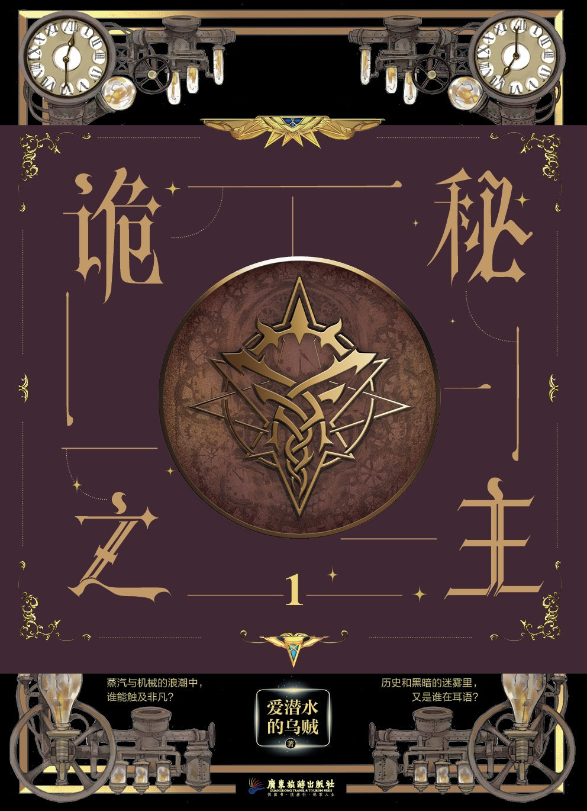
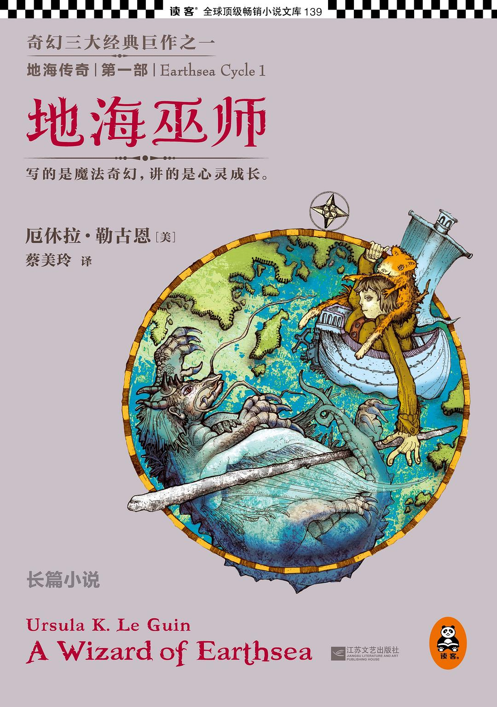

| [诡秘之主](https://book.douban.com/subject/35051813/) | 诡秘之主 作者: [爱潜水的乌贼](https://book.douban.com/search/爱潜水的乌贼)      ▶故事简介◀   周明瑞一夜醒来，发现自己成了鲁恩王国霍伊大学历史系的毕业生克莱恩·莫雷蒂。他有一兄一妹，生活清贫，还遭遇了一场关乎生死存亡的危机。   为求自保，亦为回归，他启用神秘仪式去往灰雾之上，意外点亮了深红星辰，并以“愚者”之名，召唤活泼可爱的“正义”小姐、心思深沉的“倒吊人”组成塔罗会。在邓恩队长的介绍下，他加入护卫廷根市的值夜者小队，追踪安提哥努斯家族笔记下落，并且服下“占卜家”魔药，正式踏上非凡之路！   这个蒸汽机械与克苏鲁魔法的世界妙不可言，危险与机遇也总是如影随形！克莱恩能解决时刻笼罩着他的死亡危机吗？诡秘之秘，不可言说。 |
| :----------------------------------------------------------: | :----------------------------------------------------------- |
| [地海传奇：地海巫师](https://book.douban.com/subject/24882304/) | 地海传奇：地海巫师 作者: [(美)厄休拉·勒古恩](https://book.douban.com/search/厄休拉·勒古恩)      ▶故事简介◀   牧童雀鹰天生拥有法力，他渴求更强大的力量和更深奥的知识，于是选择离开故乡，前往传奇的巫师学院学习，以求出人头地。为了证明实力，他当众施展禁忌法术，召唤亡灵，却铸成大错。他召唤出的恶灵追捕着他，太古的邪恶诱惑着他。为了弥补过错，他步上了一段从未有人完成的追寻之旅，直到海洋的尽头、世界终结之处…… |
| [长安的荔枝](https://book.douban.com/subject/36104107/) | 长安的荔枝 作者: [马伯庸](https://book.douban.com/author/4577534)      ▶故事简介◀   大唐天宝十四年，长安城的小吏李善德突然接到一个任务：要在贵妃诞日之前，从岭南运来新鲜荔枝。荔枝“一日色变，两日香变，三日味变”，而岭南距长安五千余里，山水迢迢，这是个不可能完成的任务，可为了家人，李善德决心放手一搏：“就算失败，我也想知道，自己倒在距离终点多远的地方。” |