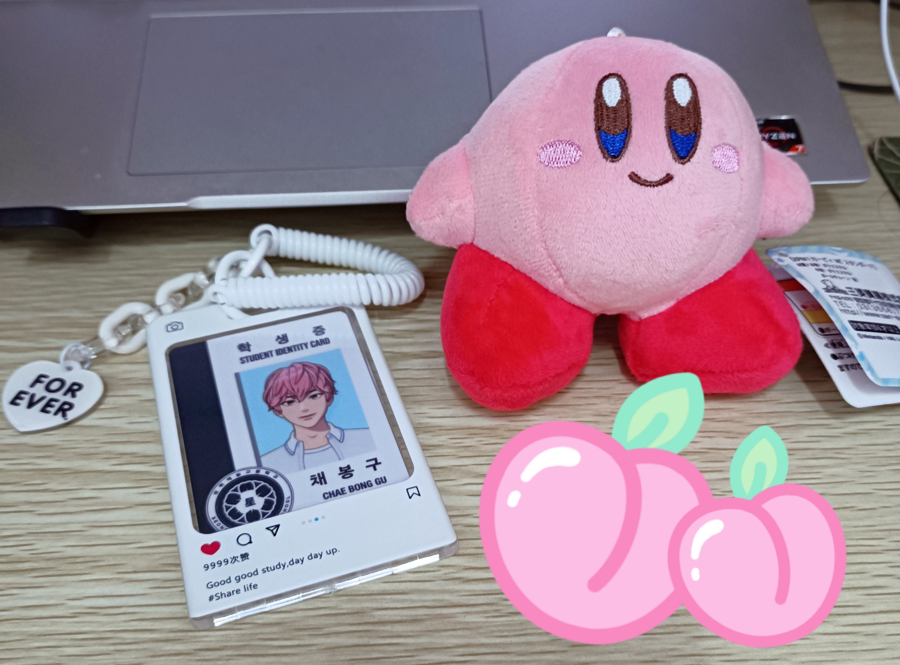
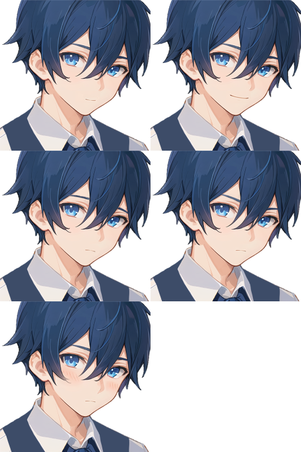
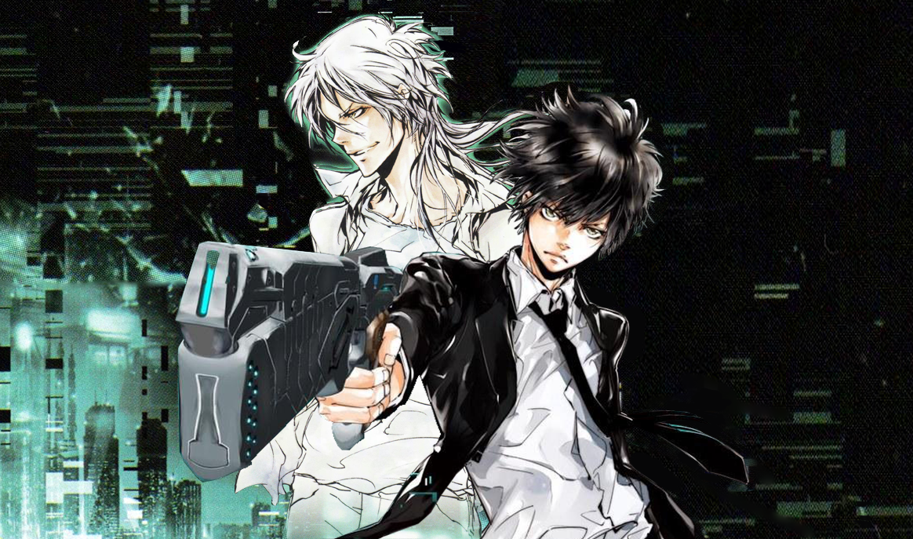
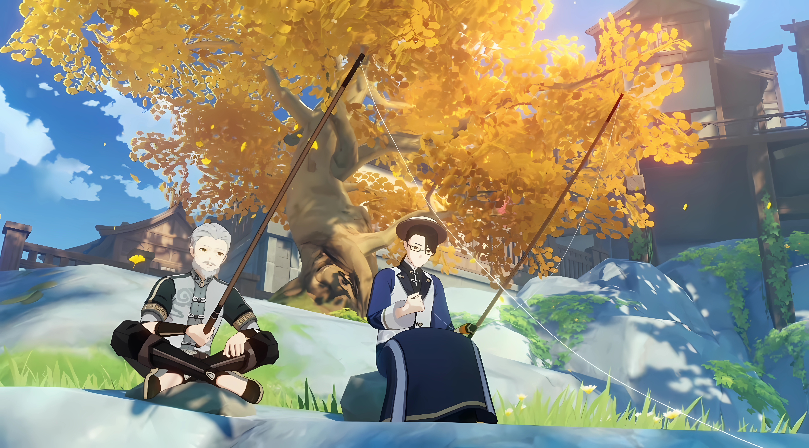
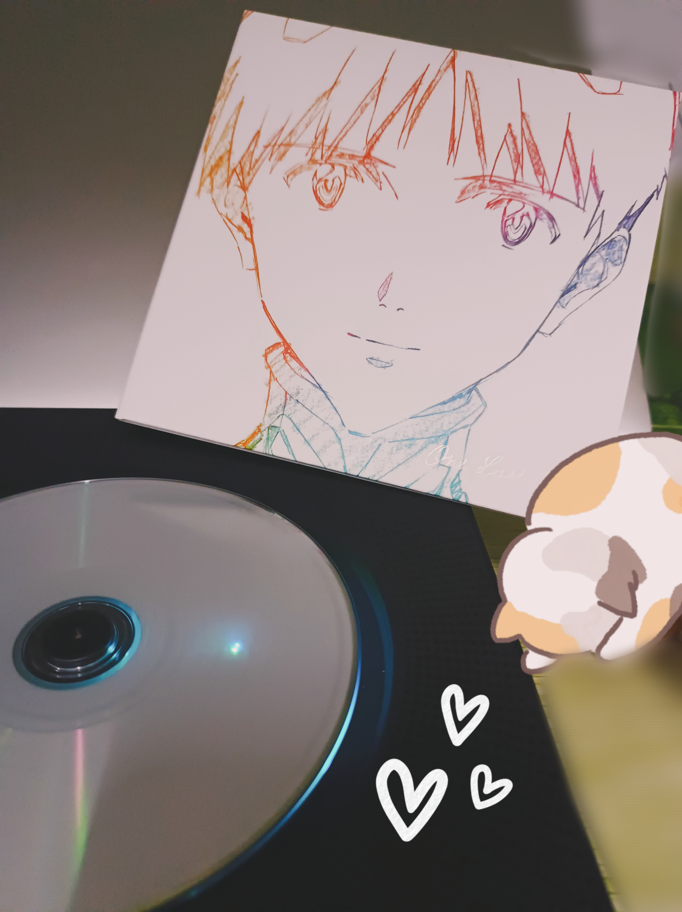



<!-- timeline 10-24 -->

虽然这样说很玄乎，但是感觉总是会遇到这种情况，比如两件本来不会牵扯上关系的事突然遥相呼应了...

比如斑比早先在官咖说的“We nailed it”，这时候还没和nail有关。后来在泡泡虎子说的“觉得斑比哥做美甲会很可爱”，提到了“nail”这个单词...然后两天前我上的课的小组实践课题就是有关美甲的！？不得不说，这种种巧合真的很意外...好吧，也许是我多想了...

所以老天到底在暗示什么？或者说，God is with me...

<!-- endtimeline -->

<!-- timeline 10-23 -->

最近特别特别想做的视频：

①旅游vlog（如果能去韩国的话！）

②PLAVE成员翻唱  可视化音频  [“因为是偶尔联系的陌生人”｜南艺俊 cover｜日推歌单｜可视化音频_](https://www.bilibili.com/video/BV1Dw411X7vD/?spm_id_from=333.1007.top_right_bar_window_custom_collection.content.click&vd_source=683accdf4a366c372d15625bf59c99d7)

③Red Velvet歌单安利向  [【Playlist】Chill Kill·正统velvet风合集歌单（红贝贝非主打vol.3）](https://www.bilibili.com/video/BV1cM411R78P/?spm_id_from=333.1007.top_right_bar_window_history.content.click&vd_source=683accdf4a366c372d15625bf59c99d7)

④INFP 剧情向MMD

<!-- endtimeline -->

<!-- timeline 10-20 -->

突然想开设一个关于游戏的板块，用来记录自己玩游戏的感受和评价~

|    [原神](https://arrietty-fly.github.io/GAME TIME/原神)     | [崩坏:星穹铁道](https://arrietty-fly.github.io/GAME TIME/崩坏：星穹铁道) | [未定事件簿](https://arrietty-fly.github.io/GAME TIME/未定事件簿) |
| :----------------------------------------------------------: | :----------------------------------------------------------: | :----------------------------------------------------------: |
| [时空中的绘旅人](https://arrietty-fly.github.io/GAME TIME/时空中的绘旅人) | [重返未来:1999](https://arrietty-fly.github.io/GAME TIME/重返未来：1999) | [明日方舟](https://arrietty-fly.github.io/GAME TIME/明日方舟) |
| [花亦山心之月](https://arrietty-fly.github.io/GAME TIME/花亦山心之月) |  [代号鸢](https://arrietty-fly.github.io/GAME TIME/代号鸢)   | [战双帕弥什](https://arrietty-fly.github.io/GAME TIME/战双帕弥什) |
|  [崩坏三](https://arrietty-fly.github.io/GAME TIME/崩坏三)   |  [阴阳师](https://arrietty-fly.github.io/GAME TIME/阴阳师)   | [最终幻想14](https://arrietty-fly.github.io/GAME TIME/最终幻想14) |

<!-- endtimeline -->

<!-- timeline 10-15 -->

虽然买不起斑比的定制娃，但是买得起卡比！真的可爱~💗🍑🍓

<!-- endtimeline -->

<!-- timeline 10-15 -->

因为音流咏叹只能做相关主题的音乐合集，但是无法记录单首歌曲的感受

所以特此开一个专属星球 →  [音乐手札](https://arrietty-fly.github.io/异世相遇/音乐手札)

<!-- endtimeline -->

<!-- timeline 10-07 -->

突发奇想，想要写一篇“追星日记”！记录和PLAVE在一起的每个值得纪念的日子~

轻轻放一个链接在这里~   [Asterum](https://arrietty-fly.github.io/异世相遇/Asterum)

<!-- endtimeline -->

<!-- timeline 09-30 -->

我是如此迫切地想要逃离家，毕业后只想去外省找工作，即使明知每次过节要花费大量路费和精力，甚至房租可能会占工资的一半以上。

究其原因，是因为我想接近我的梦想，但是我知道这个梦想在家人的眼里是不能够被理解和支持的，甚至会加以阻拦和诋毁

我也想证明自己，向那些小看我的亲戚证明我是可以独立干出自己的一番天地的，而不是连地铁都不会坐的傻瓜

我也想去看看外面的世界，结实志同道合的人们，一起去往诗和远方。

我一直觉得，我身边的大人们都在急切地想要我长大，想要我立马成为一个成熟的、老成的、合格的大人

但是在我的心里，却只想一直做个“小孩”，只想热情地、不受拘束地去做自己热爱的事，但是在现在的环境下却是那么困难

所以，我想逃离这一切，这已经是我想到的最体面的、对双方都好的结局。

<!-- endtimeline -->

<!-- timeline 09-22 -->

心血来潮想整理一下自己想要的东西~会努力挣钱的~！请给我源源不断的动力吧卡密sama！！（持续更新）

01.电子琴    ¥150

02.86-不存在的战区 专辑  泽野弘之   ¥240

03.重音Teto声库+编辑器    ¥250

04.定制码字键盘    ¥250

05.黏土制作手办     ¥500

06.定制bdj    ¥1500

07.Switch    ¥2000

08.便携Vlog摄像机  ¥2000

09.去韩国看PLAVE的演唱会   ¥6000

<!-- endtimeline -->

<!-- timeline 09-19 -->

今天买了虎子的泡泡~！是很新奇的体验！以后可以每天和虎子说早安和晚安了🥰🥰

（话说回来，本来是不打算买这个泡泡的，因为对这些并不感兴趣来着，每月还要花钱...但是当听说虎子最近因为黑子而不开心的时候，就立刻想要买虎子的泡泡了，因为想要每天告诉虎子PLLI真的很爱他，希望虎子能在满满的爱意里，不要在意那些恶言恶语）

<!-- endtimeline -->

<!-- timeline 09-16 -->

信终于写好了！！！
虽然想五人都写一封，奈何人工翻译很贵我又话痨，所以只写了给斑比和虎子的。还是第一次写这么多的韩语，浅浅记录一下～

<!-- endtimeline -->

<!-- timeline 09-15 -->

和PLAVE一起度过的第六个夏天，结束了～这次的小卡都好美！

<!-- endtimeline -->

<!-- timeline 09-06 -->

你相信这个世界上有「季节使者」的存在吗？  

传说「季节使者」是掌管季节轮转的神使，祂会周游世界的各个角落 

每到达一个地方，祂会在当地种下赋有神力的种子 待到种子发芽出土之时，下一个季节将如期而至

 ——《蓝玫瑰的赞礼》Renly

（是星露谷物语自制的NPC——蓝礼！是一位很温柔的少年~正在努力制作中！不过最近要忙着写论文一稿呜呜；；希望一切顺利~）

<!-- endtimeline -->

<!-- timeline 09-05 -->

[Newjeans  Ditto](https://www.bilibili.com/video/BV1he4y1K7nu?p=1&vd_source=683accdf4a366c372d15625bf59c99d7)

初听Ditto的时候 

那时只是赞同对幻想朋友的说法 并不赞同关于追星的解读 

因为那时的我并不追星 无法感同身受和理解 不过现在的我能够理解了

 “转眼已经长大，正如一同走过的记忆” “我喜欢你的这份心情，不觉间已夏去秋来” “心在扑通扑通地跳，我想见到你” 

就像MV里一样 你在屏幕的那边 我在屏幕的这边 我对着你笑 旁人投来不理解的注视 即使孤身一人也从未感到孤独 

或许终有一天我们会各自离去  回归彼此的现实 但录像带里保存着的我们曾一同走过的回忆 永远不会褪色和消失

<!-- endtimeline -->

<!-- timeline 08-07 -->

与其说是升级和进化
不如说是回到了最原本的形态
人们原本就有着强大的力量
只不过是因为种种事情封闭了他们原本的力量
从而遗忘了他们自身的强大
如果想要回到最初的形态
人们需要找到原本的自我

——女神异闻录5  人格面具的最终形态

<!-- endtimeline -->

<!-- timeline 08-01 -->

听着NewJeans的Hurt

突然醒悟到

“歌曲”原本就是为了诉诸情怀

是人们传达情绪的一种媒介

真的很佩服闵姐  让音乐回到了原本的模样

<!-- endtimeline -->

<!-- timeline 07-29 -->

喜欢一个人
是喜欢TA整体上的一个感觉
如果你能指出一个元素
那你不是喜欢TA
你只不过是喜欢TA那个元素罢了

<!-- endtimeline -->

<!-- timeline 07-20 -->

[Newjeans  Cool With You](https://www.bilibili.com/video/BV1xj411R7Mi?p=1&vd_source=683accdf4a366c372d15625bf59c99d7)

God is with you 

but you never noticed 

before that,you should find yourself.

<!-- endtimeline -->

<!-- timeline 07-17 -->

[NCT DREAM《ISTJ》MV](https://www.bilibili.com/video/BV1Bm4y1j7qo/?spm_id_from=444.42.list.card_archive.click&vd_source=683accdf4a366c372d15625bf59c99d7)

「 在MBTI主宰秩序的迷宫世界 

为了触及真实的原本的你 而不是冰冷的字母 

为了证明你我并非对立面 让我们来大闹一场 

一起逃出这楚门的世界 回到Real World 」

（看完这首歌的概念解析之后，真的不得不佩服SM的概念设计。很想写一本小说，世界观背景就是在以MBTI为秩序主导的世界，主角团们力求突破找寻自我的故事！看来得开始深入研究一番MBTI的内核了呢，开笔~！）

<!-- endtimeline -->

<!-- timeline 07-15 -->

[&TEAM 'FIREWORK' Official MV](https://www.bilibili.com/video/BV1Eh411T7nh/?spm_id_from=333.337.search-card.all.click&vd_source=683accdf4a366c372d15625bf59c99d7)

沉湎于梦境的狼人少年
点滴回忆中都是和少女在一起的美好过往
一起看璀璨的烟花在空中绽放
一起在篝火旁谈笑风生
一起庆祝生日派对、在海边嬉戏玩闹

然而当梦醒时分
眼前的少女却不是记忆中微笑的模样
而是“熟悉但又陌生”的冰冷决绝的目光
少女身后背着的巨大猎枪
尽管看起来与少女纤细的身型十分违和
而当少女娴熟矫健地举起猎枪瞄准时
当死神来临的那一瞬，少年又在想些什么呢？
会是少女的笑颜吗……？

狼人少年早已分不清何为梦境与现实
或者可以说 少年并不想弄清
少年曾无数次想过这个问题：
“她笑起来的模样会是怎样的呢？”
……

“难以想象，我们在梦境的镜像世界里，遇见的那位爱笑可亲的少女，现实中却是宿主的……猎杀者？”
“就连我们看到的那场璀璨梦幻的烟花……实际上却是现实中猎杀者追击宿主时的猎枪声和火花……”
全场只剩下静默。

<!-- endtimeline -->

<!-- timeline 07-12 -->

突然想到
前段日子在微信上认识一位看手相的师傅
我把我的手掌拍给了他
还有生肖年龄性别
惊讶地发现师傅居然真的很准100%
性格特征这方面真的百分百中
不得不感叹玄学的奇幻

如果换个角度胡思乱想一下
手纹这种东西如果能代表一个人的命运
是不是就表示着在我们生下来的那一刻
我们的命运就已经注定了呢？
所谓人生
不过是一场早已注定结局与过程的上帝游戏？
上帝早已为每个人制定了相应的经历和结局？
而答案就隐藏在我们的身体中？

<!-- endtimeline -->

<!-- timeline 07-07 -->

今天爱丽丝疯狂回归通关了  总用时18.6h
通关后心里久久不能平静

爱丽丝的身世真的好可怜……
那个伪君子真的很可恶！！！
即使最后仙境变回了原本美好的模样
但我还是无法接受这一切的真相
无法接受爱丽丝所遭遇的一切……

意难平啊
再想到爱丽丝的游戏制作人的新游
再也无法获得版权
更感到意难平了……

<!-- endtimeline -->

<!-- timeline 07-02 -->

突然想到
如果未来数字生命实现人类全覆盖
那不是更危险吗？
原本拥有大脑和肉体的人们
完全可以自由控制自己的思想和行为
但是一旦变成了一堆数据
即使获得了“永生”
但如果未来有人想要暗中操控数据，从中做坏
一旦被黑入数据和入侵
那数字生命的人们不是很容易会被控制吗？
甚至变成只会遵从代码指令的傀儡……

突然想到那句话，大概意思就是
作为一个人类，最宝贵的宝藏，莫过于拥有自我意志

<!-- endtimeline -->

<!-- timeline 05-17 -->

想制作一张自作曲专辑！现在就从零开始学音乐制作~！
第一张专辑名就叫《Read Me Like A Book》，主要分为两部分【Day】&【Night】：
☀【Day】

①Read Me Like A Book

「是主打曲！想主要以英文歌词为主，是全专的核心主题。“read someone like a book”是对某人的心思了如指掌的意思，其实我更喜欢直译的感觉，就是那种在休闲恬静的清晨或午后，轻轻地、温柔地一页一页翻阅着手中书的那种感觉。这本书可以是科幻、爱情、冒险、童话、哲学、百科亦或是日记等...希望这本书可以带给你不一样的感觉！」

②第二反应

「是相对于第一反应而言的！主要是因为我有时候反射弧会很长哈哈，如果说第一反应是潜意识，那第二反应就是...」

③精神乌托邦

「如果现实世界无法实现乌托邦的话，那精神世界一定可以吧！就像白日梦一样梦幻...这是精神食粮！」

④INFP

「想做成那种拼接曲！一半emo一半热血的那种，就很像我的精神状态哈哈哈。如果可以的话，下辈子也要做小蝴蝶！」

⑤Karma

「因果报应...所有恶人都应该得到应有的报应，比如最近的那些键盘侠...想顺着网线去制裁那些人...」

🌙【Night】

一、灵魂永夜 24:00

「每到24点就灵感冒出！我很喜欢24这个数字，可能是因为我生日24号，强迫症一般地喜欢双数，然后也经常熬夜到24点哈哈哈哈」

二、3min

「三分钟是一首歌的时间，也可以是脑洞大开、胡思乱想的三分钟！想做一个坐在地铁里的动画短片，周围场景从现实和幻想不断切换的那种feel！」

三、With You

「是一首想写给PLAVE的歌。想用韩文歌词，所以会努力学韩语的！想告诉他们这份心情...I hate the world,but I love the world with you.」

四、Love Myself

「无需你告诉我我是谁，我只想做我自己，仅此而已。但是做自己却又那么难，你告诉我应该像他们一样，但是却从不考虑我的意愿...」

五、Love & Peace

「我们用着不同的语言，但却有着一样的心思......想写一首能让各国人都感到爱与和平的歌曲，因为现代社会各国的人们总是各自敌对和偏见。有没有一首歌可以让人们回忆起和平的来之不易呢？」

六、Call Me Psycho-Poet

[IVE回归先行曲《Off The Record》MV_](https://www.bilibili.com/video/BV1Qu411T7vG/?spm_id_from=333.788.recommend_more_video.-1&vd_source=683accdf4a366c372d15625bf59c99d7)

暂定这些吧！先画饼才有动力去实现呐~！

<!-- endtimeline -->

<!-- timeline 04-29 -->

以前，我一直觉得
那些喜欢追星的人大都愚昧跟风
轻蔑地觉得他们不过是肤浅地看中皮囊和流量

但是自从当我遇见PLAVE
我觉得……这种想法是不对的
所谓偶像，他们带给粉丝的力量和情绪价值是值得肯定的

比如现在的我，心情低落，对未来感到迷茫和无力的时候
PLAVE总是能带给我重拾信心的勇气和信心
就好像……
即使身处火热，只要看到他们岁月静好的模样，单曲循环着他们的歌，即使身处在世俗横流的世间百态中
身心也会感到无限的幸福和勇敢

这应该就是Newjeans的Ditto中所讲到的
爱豆与粉丝之间的纽带所在
PLAVE和PLLI 以后也一起走下去吧！

<!-- endtimeline -->

<!-- timeline 04-28 -->

[24人大型女团tripleS首支小分队出道曲Generation MV](https://www.bilibili.com/video/BV1Se4y177DW/?spm_id_from=333.337.search-card.all.click&vd_source=683accdf4a366c372d15625bf59c99d7)

听着TripleS的generation
感觉焦虑的心情又重新回到了平地
想着如果能有下辈子
希望学生时代的自己能够不要再畏惧旁人的目光
去自我的、自由的活着
而不是装作世俗意义上的“好孩子”
而是尽情去做自己想做的，喜欢做的
而不是被各种压抑和规则所束缚

当然，我的意思不是说规则是不好的存在
而是指某些束缚人的特殊性的“规则”
比如“大家都这样，为什么你偏要不一样”
“他们做了，你也应该去做”诸如此类

黑塞说过：每个人还是唯一的，特殊的，在任何情况下都极为重要、值得注意的点。
罗翔老师也说：人的尊严和个性是自由的灵魂，而“多数人的暴虐”则扼杀人的自由和个性，社会常常利用各种手段迫使人抛弃自己的个性去顺应主流的看法，这种借公共意见或社会习俗对个性造成的压抑，被称为“社会的暴虐”，难以逃逸，因为它深入生活细节，以及深入灵魂的深处。

加油！
所以，从今天开始，做“自己”吧！

<!-- endtimeline -->

<!-- timeline 04-15 -->

从今天开始创建属于自己的公众号！！
创作内容的话
目前想到的是分享影评和原创短篇小说吧
名字就叫书之行.后世纪了~
加油加油~

<!-- endtimeline -->

<!-- timeline 03-29 -->

[【4K/60FPS】全站最高画质 86-超大型网恋奔现现场！蕾娜首次与辛见面](https://www.bilibili.com/video/BV1Y3411s784/?spm_id_from=333.337.search-card.all.click&vd_source=683accdf4a366c372d15625bf59c99d7)

看到了B站大家剪的86不存在的战区的大结局，大家终于相见了！！！！这一幕真的好感动！！！！😭😭

看到这一幕，我真的觉得自己此生入ACG无悔了，这就是我热爱动画的理由啊！！😭😭

86，心中永远的神番！

<!-- endtimeline -->

<!-- timeline 03-25 -->

好心疼大臣啊呜呜X﹏X
穷奇漫长的一生都在镇守蚓厄
这一次偶然被放出来来到人间
在人间的旅途中与很多人相遇
并且因玲芽的温暖而喜欢上玲芽
想要和玲芽一起生活的念头油然而生
因此对人间有了留恋之情
也曾自私地想要让草太代替自己成为要石
这样自己就能抛下使命和玲芽在一起生活
但最终还是为了苍生回归了自己的使命
可想而知
当大臣再次回到那里继续镇守要石的时候
要与人间分别，与玲芽分别的时候
大臣的心情该是多么难受和落寞不舍呢

我突然就想问
那些终身使命是镇守恶灵的人
他们自己内心的意愿是怎样的呢？
他们会不会有时候也会感到孤独和放弃？
他们真的百分百愿意一生镇守于此吗？
为了苍生，为了别人牺牲自己的一生自由？
可是真的有人在乎他们的感受吗？
都觉得“理所当然”罢了吧
就像觉得姨妈对自己的爱也是“理所当然”
……

想写一个故事
讲述一个镇守了千年怪物的人
偶然来到了人间
认识各种人，看遍人间风景和人情之后
在回归使命和留在人间徘徊不决之间
最终还是选择回归使命的故事
但我想要交付的结局并不是牺牲一人保全苍生的个人英雄主义结局
我想描写一个大家共同抵御灾厄怪物
一起为他承担这份使命的群像故事！！
“我们一定可以找到一个不用牺牲你一人的办法，让我们一起去面对吧！！！这次！！”

<!-- endtimeline -->

<!-- timeline 03-07 -->

[免 罪 体 质](https://www.bilibili.com/video/BV16L41117dP/?spm_id_from=333.999.0.0&vd_source=683accdf4a366c372d15625bf59c99d7)

槙岛圣护×慎导灼   

 “免罪体质者天生就是罪人  同时也是圣人”  

剪了PP里最喜欢的两个角色！为了剪这个视频已经重刷了不下十遍PP

主要是想剪下他们眼中的世界是怎样的

西比拉说：

「 免罪体质是天生的，免罪体质者天生就是罪人，同时也是圣人，拥有着不会被人类过往规则和一般伦理所束缚的非常规人格，但也因此承受着蚀骨的孤独 」

在n重刷的过程中，感觉更能理解角色的内在想法了

<!-- endtimeline -->

<!-- timeline 02-04 -->

创作者重要的是广度
有着各种各样的见识
才有创作各种题材的土壤
然后有着某一领域的深度
才有作品内涵或内容的储备

<!-- endtimeline -->

<!-- timeline 01-20 -->

[【原神夜兰传说任务】天叔后续+过场动画](https://www.bilibili.com/video/BV1rW4y1C7NX/?spm_id_from=333.337.search-card.all.click&vd_source=683accdf4a366c372d15625bf59c99d7)

权谋算计固然重要

更重要的却是恪守本心

权谋算计永无止休 应付不来的话 

倒不如置身事外  反而能看清许多东西

每个人都有欲望  但不可被欲望掌控 

不必计较暂时的得失  向着内心所想的方向前进就好

人生就像垂钓  容不得半点焦躁

做人做事  都不可急于求成

年轻的时候总想着证明自己

后来才意识到

事情并不总会如我预想的那样发展

把心沉下来才能继续前进

你还年轻  要耐得住寂寞  要相信自己  不必靠外物去证明你的价值

——天枢星.天叔

<!-- endtimeline -->

<!-- timeline 01-02 -->

[Newjeans  OMG MV](https://www.bilibili.com/video/BV1W44y197Hw/?spm_id_from=333.337.search-card.all.click&vd_source=683accdf4a366c372d15625bf59c99d7)

「 五个少女围坐在一起，开始自我介绍。
“我是iPhone里的siri，每天竭诚为您存在和服务。”
“我呢其实是十二点后逃窜在外的睡公主，醒来之后点燃火柴没有等来我的王子，反而召来了黑暗女巫，她给了我一个毒苹果，所以我才会在这里。”
“我是一只猫，最喜欢的是人类做的猫条～”“你问我为什么一直蹲在这？我是一只蘑菇啊，你也是蘑菇吗？”
“我不是病人，我是医生啊！我会穿越时空，哪里需要我治疗，我就能及时出现哦！”
面面相觑之后，五位少女得出一致的结论：“看来我们一定很聊得来！”
另一边，目睹这一幕的研究员们不禁默言，过了一会儿才终于有人打破了沉默，
“部长，这些孩子真的能胜任这项任务吗？”“你觉得呢？”
部长并未正面回答，但脸上欣慰的笑容却又好像说明了一切。那是在地面被外星不明精神电波入侵后的阴霾下，失去家园的人们脸上早已消失的笑容...... 」

（是看完MV之后突然的脑洞！这首歌真的听一遍就爱上了，不愧是闵姐yyds！听完之后有一种被温暖包裹的感觉，很有奇思妙想的感觉~真的好怀念啊，小时候的各种脑洞和奇思妙想，孩子们无穷的、神奇的想象力，是十分珍贵的东西呢...如果可以的话，我真不想长大，想一直活在自己的幻想的精神世界里，和我的幻想朋友们待在一起...）

<!-- endtimeline -->





<!-- timeline 12-18 -->

最近喜欢上了宇多田光sama～
其实之前就很喜欢她的一首歌good night来着，看企鹅公路的时候就被这空灵独特的歌声吸引了。但是却没有去详细去了解过她。
直到听到「one last kiss」这首歌就一发不可收拾地陷进去了！世界上怎么会有这么完美的歌手啊～
她的歌声有一种治愈人心的奇效，也是因为这首歌，我又去看了一遍之前没看完的EVA，看完tv版和剧场版之后，然后又一发不可收拾地陷入了EVA的世界里......尤其是渚薰和真嗣，真的是两个小天使啊～
买了人生的第一张CD就是光的one last kiss 初回（因为入坑太晚只能买到台压版的orz）还有CD机！
不过奈何在寝室不能外放打扰到其它室友，所以等期末放假回家我一定要听个爽！

<!-- endtimeline -->


