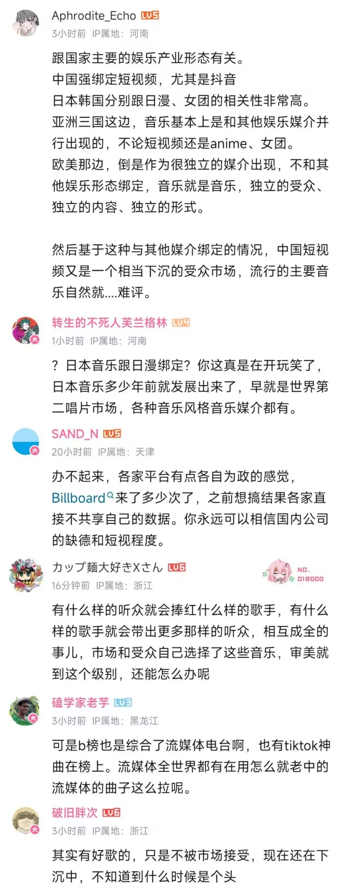

| [画饼充饥](https://arrietty-fly.github.io/私语札记/画饼充饥) | [脑洞宇宙](https://arrietty-fly.github.io/私语札记/脑洞宇宙) |
| :----------------------------------------------------------: | :----------------------------------------------------------: |
| [映像研究部](https://arrietty-fly.github.io/私语札记/映像研究部) | [音乐手札](https://arrietty-fly.github.io/异世相遇/音乐手札) |
|  [Asterum](https://arrietty-fly.github.io/异世相遇/Asterum)  | [GAME TIME](https://arrietty-fly.github.io/私语札记/GAME TIME) |



<!-- timeline 01-20 -->

今天抽空去听了美英和日本的billboard榜单🎶听完最新一周的周榜之后，我的感想是难评…首先是日本，我发现日本大部分曲目都是偏摇滚乐，我不太懂这方面，就是感觉乐器的存在感很强，这种曲目一般都是以有爆发力的厚男声为主，不知道为啥我听这种歌曲不太入耳，也很少我喜欢的音色，可能是因为我平常很少听这种类型的，平常听惯了Kpop那种的…然后是美英，是我不想再看第二遍的程度，里面有好多歌词很那啥的歌曲，只能说不愧是风气很自由的欧美地区……我觉得我以后还是刷到啥听啥好了，我算是知道了各地区的人们的音乐审美和喜好差异很大，中日韩美四国的喜好差异真的好大，感觉受到了很多冲击…最合我口味的最后还是Kpop，估计是从初中就养成的习惯😓反正对于我个人来说，首先歌手的音色是很重要的，好的音色甚至能让一首歌起死回生，然后是歌词是否具有深刻的内涵，好的作曲也是一首歌的灵魂所在，好的编曲也能给这首歌加分不少，总之是相辅相成的作用~歌手的人格魅力也可以加很多分，比如可以自作词作曲编曲，也是很厉害的呢~不过在如今这个以资本和流量为主的市场环境，大多好的音乐作品却很难被大众发现，我也很难评价了…

<!-- endtimeline -->

<!-- timeline 01-18 -->

今天刷到了一个视频，关于"2023年中日韩美年度歌曲top5"的，看完之后我真的对华语乐坛无言以对🙁2023年的第一是爱如火，那今年的第一应该就是科目三吧……仔细研究了一番评论区，有几个评论我觉得有些道理——

说实话，我现在突然有一种想法，想开通一个抖音账号，专门做推荐华语歌的短视频，让大家也来看看其实华语乐坛也有好歌的，这些歌也值得火一把😞虽然我听华语歌一年比一年非常少，现在歌单几乎Kpop和jpop占八成，不过我以后会积极发掘华语好歌的！不过确实，中国缺少权威榜单、打歌舞台和专业的音乐制作人，以至于大家都把目光集中到了别处，以至于好的音乐很少被大家发现……然后我也想深入了解一番billboard榜单，发掘各国更多好听的歌曲！

<!-- endtimeline -->

<!-- timeline 01-16 -->

感觉最近好空虚，因为没有可以分享喜悦和共同话题的朋友，就是那种灵魂伴侣，没有……感觉很多时候都是我一个人在自言自语，对于我说的话她们都并不感兴趣，这种兴致勃勃地分享出去最终只获得一瓢冷水的感觉真的很凄凉😔然后要去积极回应别人发来的话题、但我其实并不感兴趣的时候，也让我觉得能量被吸走了一样有气无力…这世界上那么多人，想找个有共同兴趣爱好、共同目标和价值观的好朋友为什么这么难呢？

有人说我是回避型人格，但是又何曾有人愿意去了解真正的我呢？又有谁愿意接纳那个并不开朗活泼实则阴暗自卑的那一面的我呢？没有，从来没有人愿意去了解完整的我。以至于在人际交往中，我好像一直在戴着面具，因为我知道一旦我变得脆弱变得直言，他们就会立刻讨厌我并远离我，因为从来没有人愿意去了解真正的、完整的我，不是吗？所以，只需要伪装就好，尽管这不是我想要的，我也会变成你想要的我的样子，让你开心让你满足。或许这也是为什么我一直沉浸于虚拟世界的原因吧，唯有在这里我才能真正地做回我自己，做回那个有一些脆弱和任性的自己，那里有我喜欢的人和事物，能看到和我一样想法和共鸣的陌生人。

难道在互联网找一个灵魂伴侣也找不到吗？说实话也很难，毕竟每个人都有属于自己的人生。其实以前有一个姐妹和我很聊得来，是在可话上遇见的，记得起初是我在上面发了关于宇多田光的帖子，她说她也喜欢宇多田光的音乐，我真的很开心，因为在平常的日子里没有人会向我主动聊起我喜欢的事物。我们聊了很多，惊讶地发现她也是INFP，也是大二生，且也有着和我一样的志向和目标，之后我们也曾想一起构思和制作属于我们的游戏世界，也有很多共同的感情共鸣和价值观，和她在一起分享和交流的日子很开心很满足，但是她最终还是去专心考研了，所以也断了联系，真心地祝愿她能考上梦想的学校和专业💐

或许吧，就像那句话说的一样，只有当你的梦想获取了一定的成绩时，你才能吸引更多和你有着相同共鸣和理想目标的人，毕竟站得高才能让更多人看见你、发现你。

<!-- endtimeline -->

<!-- timeline 01-01 -->

既然新的一年到了，那我也来设立一个新年目标吧~等到2024年末的时候再看看实现了几个哈哈😗
①出首张音乐专辑💿
②创作独立游戏，并上架Steam🎮
③原创小说上架平台🖋️
④板绘修成正果（动画/手书）🎨
⑤原创漫画上架平台🗯︎
⑥企划进行中️×5🎞

<!-- endtimeline -->





<!-- timeline 12-31 -->

记录一下2023年心中的年度歌曲~
①NewJeans《Ditto》🎼
第一首是当之无愧的Ditto！！歌曲和MV配合看简直如同神作，可以说是从年初一直听到年尾，初听的时候觉得是在讲述和幻想朋友的故事，那时还不赞同关于追星的解读来着哈哈，不过自从在四月遇见五小漫之后，感觉对这首歌的感情更加深刻了许多，回首再看MV时，才惊觉原来我就是那个举着摄像机的女孩…

②NewJeans《OMG》🎼
没错，还是NewJeans的歌~真的很佩服闵希珍的选歌品味，这两首歌听起来都和以往听过的Kpop女团歌很不一样！！然后MV也很绝，有很强的叙事感，就像是在看一部电影一般，让人印象深刻，让人能在其中看到属于自己的故事，也能从中获取灵感…同时，也是这首歌再一次引发了我对于追星的思考，一首歌能引发人们的思考和感悟，我觉得这就是一首很好的音乐作品。

③新少年《乱春》🎼
这首歌第一次听是来自艺俊的翻唱~在听艺俊翻唱的时候，这首歌就已经深深触动了我，以至于心里百感交集，眼泪也忍不住流了下来，当时把我自己也吓了一跳，因为我已经很久很久没有因为一首歌而流眼泪了…再去听原唱的时候，发现是完全不一样的感觉，整颗心都仿佛纠在一起，但是当看到MV最后女孩从波涛汹涌中重新站起来时，又仿佛看到了生的希望…感谢艺俊的歌声，以及这首歌，陪伴着我度过了那段艰难的日子…

④PLAVE《Wait for you》🎼
梦开始的地方…这首歌真的是仙曲！当时不怎么听男团歌的我，一直对男团歌抱有偏见，觉得男团歌总是充斥着吵耳朵的Rap和炫技，令人费解…但是这首歌就很好听，无论是Vocal还是Rap都很悦耳，打破了我的固有偏见…而且MV也做的很好，尤其是最后大家一同仰望星空的那个镜头，给这首歌赋予了一种圣洁梦幻的色彩，再结合诺亚手中魔法书上的文字写着“请帮助这世界上所有夜空中无数的星辰，流星雨和极光，让它们能闪闪发光”，更感觉到一种神圣之感，令人动容…

⑤XG《Left right》🎼
今年最惊喜的女团XG！！这首歌真的百听不厌，动听的旋律和人声，每次听都感觉有不同的体验！我尤其喜欢上田纯利亚juria的音色，是唱R&B的天选之子呢~同时也是这首歌让我打破了对日本女团的刻板印象，是实力和歌力都很强悍的组合呢，如同横空出世一般，令人惊艳。

<!-- endtimeline -->

<!-- timeline 12-23 -->

我终究还是忍不住买了NewJeans的OMG的专辑，丹尼尔的单封，在闲鱼上淘的25块，这应该是我买的第三张专辑~主要是因为这张专辑收录的两首歌Ditto和OMG我真的超爱，可以说是人生歌曲也不为过的程度。

买之前还在考虑是只买CD呢，还是买整套哈哈，最终还是买了整套，就是不包含专卡。没有专卡倒无所谓，毕竟我只是买来收藏和听歌的，对爱豆本人倒没啥很大的兴趣。收到快递之后就立马放在CD机上听了一遍，啊啊这两首歌还真是从去年年底听到现在都没腻，也是很神奇呢。然后还看了下专辑配置，真的有好多好多的明信片，每张明信片上都写着一段话，应该是对粉丝的话吧，感觉很有诚意。然后歌词本很有趣，OMG的歌词是一个很大的圈圈哈哈，看歌词跟坐过山车一样哈哈哈哈，这个排版设计我服了好吧😆

然后pd的话，无论是pd的尺寸大小，还是pd的色调光影，甚至是pd的香味，都给我一种回到了90年代的感觉，就是我们父母那一代的青春岁月…那个年代，应该很流行明信片吧，所以这也是为什么专辑里有这么多的明信片？可能这也是为什么我看着MV听着歌觉得很感动的原因之一吧，虽然我没接触过那个时代，却也看过不少相关的作品。突然就明白了NewJeans的概念，她们所连接的正是那个时代和现在这个时代啊……还是那句话，很佩服NewJeans制作组的概念设计和音乐品味。

<!-- endtimeline -->

<!-- timeline 12-14 -->

仅仅只是想记录这种感觉…今天看了nano担任制作人的选秀节目cut，第一眼就注意到了他旁边坐着的女孩——Adora，是让人不禁感叹很漂亮的一位女生呢，没想到这么年轻就能够上选秀节目和nano一起担任制作人了，看得出真的很厉害很有才华，而且笑起来时眼睛弯弯的真的很可爱，让人看到心情都感觉变好了的笑颜😇
去详细了解了一番，Adora真的很有才华。是大黑制作人选拔中以第一名入选，大黑唯一的女制作人，一同创作过许多歌曲，参与过很多大火组合的和声，并受到一众好评。并且还坚定梦想，现在离开了大黑选择solo出道，唱着自己的音乐。翻看她的ins，发现她很喜欢记录生活，总是笑盈盈的像个小天使，无忧无虑的自由的灵魂，感觉被圈粉了…

好羡慕啊，发现确实我推身边都是很优秀的人呢，果然优秀的人身边都是优秀的人，不知为何，我心里突然有一点失落…感到自己的生活离他们太远太远，感觉根本不在一个世界和次元，根本无法相提并论😔看见他们在舞台上发光发热，在灿烂的阳光下热烈地追求着不平凡的人生，而反观我似乎一直在暗处阴暗爬行(?)呵呵，这又何尝不是Ditto里B side的剧情呢，简直一模一样……可是我不会就此气馁而放弃的，为了能够和你们望着同一片广阔的天空，我一定会努力变得更好更优秀的嗯嗯！

<!-- endtimeline -->

<!-- timeline 11-13 -->

啊啊啊看到艺俊和河玟一起玩动物森友会，来自远古之前的一股羡慕又上心头......

可恶我以后工作赚了钱我也要买Switch和动森，然后把我的小岛装饰的美美的~

我现在甚至有这种感觉，我三次元的家可以简陋一点无所谓，但是我二次元的家一定要丰盛！(?)

<!-- endtimeline -->

<!-- timeline 10-24 -->

虽然这样说很玄乎，但是感觉总是会遇到这种情况，比如两件本来不会牵扯上关系的事突然遥相呼应了...

比如斑比早先在官咖说的“We nailed it”，这时候还没和nail有关。后来在泡泡虎子说的“觉得斑比哥做美甲会很可爱”，提到了“nail”这个单词...然后两天前我上的课的小组实践课题就是有关美甲的！？不得不说，这种种巧合真的很意外...好吧，也许是我多想了...所以老天到底在暗示什么？或者说，God is with me...

<!-- endtimeline -->

<!-- timeline 07-29 -->

喜欢一个人
是喜欢TA整体上的一个感觉
如果你能指出一个元素
那你不是喜欢TA
你只不过是喜欢TA那个元素罢了

<!-- endtimeline -->

<!-- timeline 07-12 -->

突然想到
前段日子在微信上认识一位看手相的师傅
我把我的手掌拍给了他
还有生肖年龄性别
惊讶地发现师傅居然真的很准100%
性格特征这方面真的百分百中
不得不感叹玄学的奇幻

如果换个角度胡思乱想一下
手纹这种东西如果能代表一个人的命运
是不是就表示着在我们生下来的那一刻
我们的命运就已经注定了呢？
所谓人生
不过是一场早已注定结局与过程的上帝游戏？
上帝早已为每个人制定了相应的经历和结局？
而答案就隐藏在我们的身体中？

<!-- endtimeline -->

<!-- timeline 07-07 -->

今天爱丽丝疯狂回归通关了  总用时18.6h
通关后心里久久不能平静

爱丽丝的身世真的好可怜……
那个伪君子真的很可恶！！！
即使最后仙境变回了原本美好的模样
但我还是无法接受这一切的真相
无法接受爱丽丝所遭遇的一切……

意难平啊
再想到爱丽丝的游戏制作人的新游
再也无法获得版权
更感到意难平了……

<!-- endtimeline -->

<!-- timeline 04-29 -->

以前，我一直觉得
那些喜欢追星的人大都愚昧跟风
轻蔑地觉得他们不过是肤浅地看中皮囊和流量

但是自从当我遇见PLAVE
我觉得……这种想法是不对的
所谓偶像，他们带给粉丝的力量和情绪价值是值得肯定的

比如现在的我，心情低落，对未来感到迷茫和无力的时候
PLAVE总是能带给我重拾信心的勇气和信心
就好像……
即使身处火热，只要看到他们岁月静好的模样，单曲循环着他们的歌，即使身处在世俗横流的世间百态中
身心也会感到无限的幸福和勇敢

这应该就是Newjeans的Ditto中所讲到的
爱豆与粉丝之间的纽带所在
PLAVE和PLLI 以后也一起走下去吧！

<!-- endtimeline -->

<!-- timeline 04-15 -->

从今天开始创建属于自己的公众号！！
创作内容的话
目前想到的是分享影评和原创短篇小说吧
名字就叫书之行.后世纪了~
加油加油~

<!-- endtimeline -->

<!-- timeline 03-07 -->

[免 罪 体 质](https://www.bilibili.com/video/BV16L41117dP/?spm_id_from=333.999.0.0&vd_source=683accdf4a366c372d15625bf59c99d7)

槙岛圣护×慎导灼   

 “免罪体质者天生就是罪人  同时也是圣人”  

剪了PP里最喜欢的两个角色！为了剪这个视频已经重刷了不下十遍PP

主要是想剪下他们眼中的世界是怎样的

西比拉说：

「 免罪体质是天生的，免罪体质者天生就是罪人，同时也是圣人，拥有着不会被人类过往规则和一般伦理所束缚的非常规人格，但也因此承受着蚀骨的孤独 」

在n重刷的过程中，感觉更能理解角色的内在想法了

<!-- endtimeline -->

<!-- timeline 02-04 -->

创作者重要的是广度
有着各种各样的见识
才有创作各种题材的土壤
然后有着某一领域的深度
才有作品内涵或内容的储备

<!-- endtimeline -->





<!-- timeline 12-18 -->

最近喜欢上了宇多田光sama～
其实之前就很喜欢她的一首歌good night来着，看企鹅公路的时候就被这空灵独特的歌声吸引了。但是却没有去详细去了解过她。
直到听到「one last kiss」这首歌就一发不可收拾地陷进去了！世界上怎么会有这么完美的歌手啊～
她的歌声有一种治愈人心的奇效，也是因为这首歌，我又去看了一遍之前没看完的EVA，看完tv版和剧场版之后，然后又一发不可收拾地陷入了EVA的世界里......尤其是渚薰和真嗣，真的是两个小天使啊～
买了人生的第一张CD就是光的one last kiss 初回（因为入坑太晚只能买到台压版的orz）还有CD机！
不过奈何在寝室不能外放打扰到其它室友，所以等期末放假回家我一定要听个爽！

<!-- endtimeline -->


