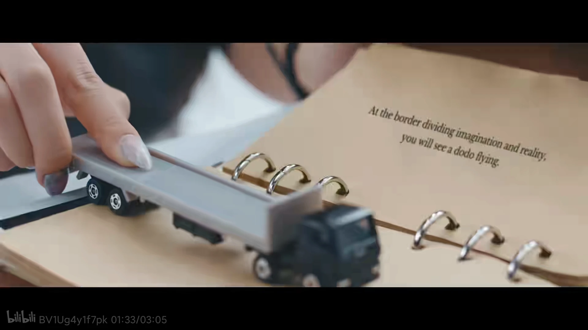

| [画饼充饥](https://arrietty-fly.github.io/私语札记/画饼充饥) | [脑洞宇宙](https://arrietty-fly.github.io/私语札记/脑洞宇宙) |
| :----------------------------------------------------------: | :----------------------------------------------------------: |
| [映像研究部](https://arrietty-fly.github.io/私语札记/映像研究部) | [音乐手札](https://arrietty-fly.github.io/异世相遇/音乐手札) |
|  [Asterum](https://arrietty-fly.github.io/异世相遇/Asterum)  | [GAME TIME](https://arrietty-fly.github.io/私语札记/GAME TIME) |



<!-- timeline 12-31 -->

记录一下2023年心中的年度歌曲~
①NewJeans《Ditto》🎼
第一首是当之无愧的Ditto！！歌曲和MV配合看简直如同神作，可以说是从年初一直听到年尾，初听的时候觉得是在讲述和幻想朋友的故事，那时还不赞同关于追星的解读来着哈哈，不过自从在四月遇见五小漫之后，感觉对这首歌的感情更加深刻了许多，回首再看MV时，才惊觉原来我就是那个举着摄像机的女孩…

②NewJeans《OMG》🎼
没错，还是NewJeans的歌~真的很佩服闵希珍的选歌品味，这两首歌听起来都和以往听过的Kpop女团歌很不一样！！然后MV也很绝，有很强的叙事感，就像是在看一部电影一般，让人印象深刻，让人能在其中看到属于自己的故事，也能从中获取灵感…同时，也是这首歌再一次引发了我对于追星的思考，一首歌能引发人们的思考和感悟，我觉得这就是一首很好的音乐作品。

③新少年《乱春》🎼
这首歌第一次听是来自艺俊的翻唱~在听艺俊翻唱的时候，这首歌就已经深深触动了我，以至于心里百感交集，眼泪也忍不住流了下来，当时把我自己也吓了一跳，因为我已经很久很久没有因为一首歌而流眼泪了…再去听原唱的时候，发现是完全不一样的感觉，整颗心都仿佛纠在一起，但是当看到MV最后女孩从波涛汹涌中重新站起来时，又仿佛看到了生的希望…感谢艺俊的歌声，以及这首歌，陪伴着我度过了那段艰难的日子…

④PLAVE《Wait for you》🎼
梦开始的地方…这首歌真的是仙曲！当时不怎么听男团歌的我，一直对男团歌抱有偏见，觉得男团歌总是充斥着吵耳朵的Rap和炫技，令人费解…但是这首歌就很好听，无论是Vocal还是Rap都很悦耳，打破了我的固有偏见…而且MV也做的很好，尤其是最后大家一同仰望星空的那个镜头，给这首歌赋予了一种圣洁梦幻的色彩，再结合诺亚手中魔法书上的文字写着“请帮助这世界上所有夜空中无数的星辰，流星雨和极光，让它们能闪闪发光”，更感觉到一种神圣之感，令人动容…

⑤XG《Left right》🎼
今年最惊喜的女团XG！！这首歌真的百听不厌，动听的旋律和人声，每次听都感觉有不同的体验！我尤其喜欢上田纯利亚juria的音色，是唱R&B的天选之子呢~同时也是这首歌让我打破了对日本女团的刻板印象，是实力和歌力都很强悍的组合呢，如同横空出世一般，令人惊艳。

<!-- endtimeline -->

<!-- timeline 12-06 -->

“在想象与现实的分界线上， 你会看到一只渡渡鸟在飞翔” 

因翅膀弱小而无法飞行的渡渡鸟 因人类活动而惨遭灭绝的渡渡鸟 世人大多认为蠢笨怪异的渡渡鸟 

“As dead as a dodo”、“逝者如渡渡” 一切逝去的，灭绝的东西，消逝的东西… 命途多舛的……

[【NMIXX】“Soñar (Breaker)” M/V](https://www.bilibili.com/video/BV1Ug4y1f7pk/?vd_source=683accdf4a366c372d15625bf59c99d7)

<!-- endtimeline -->

<!-- timeline 11-13 -->

啊啊啊看到艺俊和河玟一起玩动物森友会，来自远古之前的一股羡慕又上心头......

可恶我以后工作赚了钱我也要买Switch和动森，然后把我的小岛装饰的美美的~

我现在甚至有这种感觉，我三次元的家可以简陋一点无所谓，但是我二次元的家一定要丰盛！(?)

<!-- endtimeline -->

<!-- timeline 11-04 -->

新买的平板终于到咯！买的是联想小新的Pad Pro12.7，有足足12.7寸的大小！

以后上班就可以带着我滴平板一起了哈哈，至于我平时主用电脑为啥还要买平板的原因是...

因为电脑使用时总是要插着电用，而且外出也不方便携带，所以相比起来还是平板更容易携带且不用一直插电使用，应该还能省点电？

<!-- endtimeline -->

<!-- timeline 10-24 -->

虽然这样说很玄乎，但是感觉总是会遇到这种情况，比如两件本来不会牵扯上关系的事突然遥相呼应了...

比如斑比早先在官咖说的“We nailed it”，这时候还没和nail有关。后来在泡泡虎子说的“觉得斑比哥做美甲会很可爱”，提到了“nail”这个单词...然后两天前我上的课的小组实践课题就是有关美甲的！？不得不说，这种种巧合真的很意外...好吧，也许是我多想了...

所以老天到底在暗示什么？或者说，God is with me...

<!-- endtimeline -->

<!-- timeline 09-05 -->

[Newjeans  Ditto](https://www.bilibili.com/video/BV1he4y1K7nu?p=1&vd_source=683accdf4a366c372d15625bf59c99d7)

初听Ditto的时候 

那时只是赞同对幻想朋友的说法 并不赞同关于追星的解读 

因为那时的我并不追星 无法感同身受和理解 不过现在的我能够理解了

 “转眼已经长大，正如一同走过的记忆” “我喜欢你的这份心情，不觉间已夏去秋来” “心在扑通扑通地跳，我想见到你” 

就像MV里一样 你在屏幕的那边 我在屏幕的这边 我对着你笑 旁人投来不理解的注视 即使孤身一人也从未感到孤独 

或许终有一天我们会各自离去  回归彼此的现实 但录像带里保存着的我们曾一同走过的回忆 永远不会褪色和消失

<!-- endtimeline -->

<!-- timeline 08-01 -->

听着NewJeans的Hurt

突然醒悟到

“歌曲”原本就是为了诉诸情怀

是人们传达情绪的一种媒介

真的很佩服闵姐  让音乐回到了原本的模样

<!-- endtimeline -->

<!-- timeline 07-29 -->

喜欢一个人
是喜欢TA整体上的一个感觉
如果你能指出一个元素
那你不是喜欢TA
你只不过是喜欢TA那个元素罢了

<!-- endtimeline -->

<!-- timeline 07-12 -->

突然想到
前段日子在微信上认识一位看手相的师傅
我把我的手掌拍给了他
还有生肖年龄性别
惊讶地发现师傅居然真的很准100%
性格特征这方面真的百分百中
不得不感叹玄学的奇幻

如果换个角度胡思乱想一下
手纹这种东西如果能代表一个人的命运
是不是就表示着在我们生下来的那一刻
我们的命运就已经注定了呢？
所谓人生
不过是一场早已注定结局与过程的上帝游戏？
上帝早已为每个人制定了相应的经历和结局？
而答案就隐藏在我们的身体中？

<!-- endtimeline -->

<!-- timeline 07-07 -->

今天爱丽丝疯狂回归通关了  总用时18.6h
通关后心里久久不能平静

爱丽丝的身世真的好可怜……
那个伪君子真的很可恶！！！
即使最后仙境变回了原本美好的模样
但我还是无法接受这一切的真相
无法接受爱丽丝所遭遇的一切……

意难平啊
再想到爱丽丝的游戏制作人的新游
再也无法获得版权
更感到意难平了……

<!-- endtimeline -->

<!-- timeline 04-29 -->

以前，我一直觉得
那些喜欢追星的人大都愚昧跟风
轻蔑地觉得他们不过是肤浅地看中皮囊和流量

但是自从当我遇见PLAVE
我觉得……这种想法是不对的
所谓偶像，他们带给粉丝的力量和情绪价值是值得肯定的

比如现在的我，心情低落，对未来感到迷茫和无力的时候
PLAVE总是能带给我重拾信心的勇气和信心
就好像……
即使身处火热，只要看到他们岁月静好的模样，单曲循环着他们的歌，即使身处在世俗横流的世间百态中
身心也会感到无限的幸福和勇敢

这应该就是Newjeans的Ditto中所讲到的
爱豆与粉丝之间的纽带所在
PLAVE和PLLI 以后也一起走下去吧！

<!-- endtimeline -->

<!-- timeline 04-28 -->

[24人大型女团tripleS首支小分队出道曲Generation MV](https://www.bilibili.com/video/BV1Se4y177DW/?spm_id_from=333.337.search-card.all.click&vd_source=683accdf4a366c372d15625bf59c99d7)

听着TripleS的generation
感觉焦虑的心情又重新回到了平地
想着如果能有下辈子
希望学生时代的自己能够不要再畏惧旁人的目光
去自我的、自由的活着
而不是装作世俗意义上的“好孩子”
而是尽情去做自己想做的，喜欢做的
而不是被各种压抑和规则所束缚

当然，我的意思不是说规则是不好的存在
而是指某些束缚人的特殊性的“规则”
比如“大家都这样，为什么你偏要不一样”
“他们做了，你也应该去做”诸如此类

黑塞说过：每个人还是唯一的，特殊的，在任何情况下都极为重要、值得注意的点。
罗翔老师也说：人的尊严和个性是自由的灵魂，而“多数人的暴虐”则扼杀人的自由和个性，社会常常利用各种手段迫使人抛弃自己的个性去顺应主流的看法，这种借公共意见或社会习俗对个性造成的压抑，被称为“社会的暴虐”，难以逃逸，因为它深入生活细节，以及深入灵魂的深处。

加油！
所以，从今天开始，做“自己”吧！

<!-- endtimeline -->

<!-- timeline 04-15 -->

从今天开始创建属于自己的公众号！！
创作内容的话
目前想到的是分享影评和原创短篇小说吧
名字就叫书之行.后世纪了~
加油加油~

<!-- endtimeline -->

<!-- timeline 03-07 -->

[免 罪 体 质](https://www.bilibili.com/video/BV16L41117dP/?spm_id_from=333.999.0.0&vd_source=683accdf4a366c372d15625bf59c99d7)

槙岛圣护×慎导灼   

 “免罪体质者天生就是罪人  同时也是圣人”  

剪了PP里最喜欢的两个角色！为了剪这个视频已经重刷了不下十遍PP

主要是想剪下他们眼中的世界是怎样的

西比拉说：

「 免罪体质是天生的，免罪体质者天生就是罪人，同时也是圣人，拥有着不会被人类过往规则和一般伦理所束缚的非常规人格，但也因此承受着蚀骨的孤独 」

在n重刷的过程中，感觉更能理解角色的内在想法了

<!-- endtimeline -->

<!-- timeline 02-04 -->

创作者重要的是广度
有着各种各样的见识
才有创作各种题材的土壤
然后有着某一领域的深度
才有作品内涵或内容的储备

<!-- endtimeline -->





<!-- timeline 12-18 -->

最近喜欢上了宇多田光sama～
其实之前就很喜欢她的一首歌good night来着，看企鹅公路的时候就被这空灵独特的歌声吸引了。但是却没有去详细去了解过她。
直到听到「one last kiss」这首歌就一发不可收拾地陷进去了！世界上怎么会有这么完美的歌手啊～
她的歌声有一种治愈人心的奇效，也是因为这首歌，我又去看了一遍之前没看完的EVA，看完tv版和剧场版之后，然后又一发不可收拾地陷入了EVA的世界里......尤其是渚薰和真嗣，真的是两个小天使啊～
买了人生的第一张CD就是光的one last kiss 初回（因为入坑太晚只能买到台压版的orz）还有CD机！
不过奈何在寝室不能外放打扰到其它室友，所以等期末放假回家我一定要听个爽！

<!-- endtimeline -->


