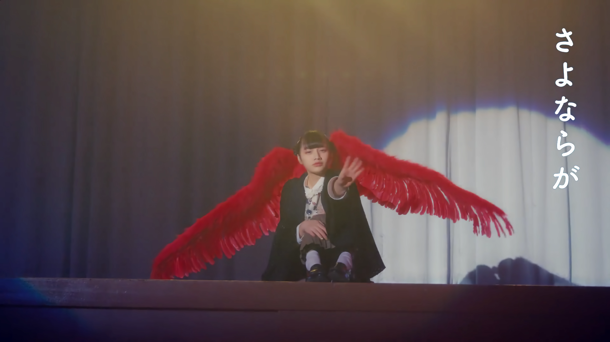



<!-- timeline 10-12 -->

<audio src="音乐手札/Noah - 致我的思春期.mp3" controls></audio>

**我有时候会希望自己 从这个世界上消失**

**整个世界太过漆黑 每晚都在哭泣的我**

**我若消失掉 心里会好受些吧**

**所有人望着我的视线 太让我害怕**

**美好的 曾经美好过的那些岁月 让我觉得很痛苦**

**不能接受爱的我 真的很讨厌** 

**妈妈爸爸都只看着我 **

**而我的心却不是那样的 却越走越远**

**怎么办 怎么办 怎么办 怎么办**

**时间是药这句话 放在我身上真的很合适**

**随着时间一天天过去 一点点都在变好** 

 **可偶尔 会怕自己太过幸福的话 痛苦又会找上我**

**怕自己拥有的幸福会被人拿走** 

**美好的 曾经美好过的那些记忆 让我觉得很痛苦**

**那种痛苦让我觉得痛苦至极 却消失不掉**

**朋友们和其他人都只看着我 **

**但我的模样明明不是这样的 却渐行渐远**

**可是想着自己 也许会是这世上 那束耀眼的光**

**想着也许熬过这所有的痛苦 **

**也只能闪烁短暂的光亮**

**无法放弃 我没有一天能安心入睡**

**即使这样也要试着振作起来 也许我能找到自己**

**该有 该有多痛 该有 该有 该有多期盼**

—— [Noah Cover - 致我的思春期（原唱：脸红的思春期）](https://www.bilibili.com/video/BV1im4y1g7nB/?spm_id_from=333.999.list.card_archive.click&vd_source=683accdf4a366c372d15625bf59c99d7)

------

这首歌好像在唱他自己的过往 也在唱我们 

其实我们大部分人的青春期 并不像电视剧里演的那样绚烂多彩 

反而总是充斥着迷茫、青涩和离别 或孤独或痛苦或害怕或自我怀疑 

但时间总是能慢慢抚平伤口和缺口

 “也许我能找到自己” 总是这样确信着 最终走到这里

<!-- endtimeline -->

<!-- timeline 10-06 -->

<audio src="音乐手札/IVE《Off The Record》.mp3" controls></audio>

**现在是凌晨两点 要压低声音 继续喃喃低语**

**若今晚夜色  再深邃一些 **

**有种可以再坦诚一点的感觉**

**有时我会做非常无理的想象 别人绝对不会知道**

**这场深夜谈话  不会入睡 **

**秘密锁上的门 将那心房向我们稍稍敞开**

**出发绝境之岛 寻找禁忌的果实 **

**有时不知为何 好奇被禁止之物**

**摘下纯真的面具 暴露出丑恶念想**

**我只是不想去餐厅 喝咖啡 看电影 那种爱情** 

**而是稍微再特别些** **我渴望隐秘又刺激的感觉**

**令人窒息的预告 还要有惊人的反转才行** 

**浪漫的疯子 若是贪恋我 一切都要坚持下去** 

**Love me love me,Leave me leave me**

**每天在折磨与治愈中挣扎 我又在呐喊 Stay**

—— [IVE回归先行曲Off The Record MV ](https://www.bilibili.com/video/BV1cm4y1G7oL/?spm_id_from=333.788.recommend_more_video.1&vd_source=683accdf4a366c372d15625bf59c99d7)

------

*“每到深夜，一些稀奇古怪的、禁忌的想象就会涌上脑海* 

*这是绝对不能告诉别人的秘密，只能在深夜里耳边私语*

*Love Me or Leave Me,Killing Me or Healing Me...到底哪个才是我真实的感受呢？”*

MV里的一些镜头也很有趣，比如"一身不良少女的穿着搭配长长的洁白头纱，在一如往常的街道上奔跑"、”深夜的耳边私语，只有月光撒下“、”肆意地在无人的小巷荡秋千，背景板是绘画仿真的蔚蓝海浪“、”房间里的巨大苹果树终于结果“、”在草地的喷洒器边肆意地笑，即使衣襟被打湿也无所谓“、“不断从天而降的彩色球滚来滚去”...

<!-- endtimeline -->

<!-- timeline 09-25 -->

<audio src="音乐手札/IVE–Either Way.mp3" controls></audio>

**有人说我语气很讨人厌 有人说我自以为是**

**还有人说是我太善良 以至于像个傻瓜**

**有时被投来不能理解的目光时 虽然会感到委屈**

**但是这些误会造就的无数个我会一同交流**

**我们全都是“我”呀**

**Either way I'm good  各方面都很喜欢**

**不存在谁对谁错 只是大家爱的方式不同**

**因为她是内向型人格 但是你是外向型人格**

**算了 就比个耶吧**

**Either way You're good 各方面都很喜欢**

**不存在谁对谁错 只是大家都以不同的方式活着** 

**各方面都很喜欢 爱与恨**

**只要全部拥有就好 没有必要只选其一** 

**Either way We're good** 

**笑一笑吧 像这样**

—— [IVE  Either Way MV](https://www.bilibili.com/video/BV1Kz4y157rJ/?spm_id_from=333.999.list.card_archive.click&vd_source=683accdf4a366c372d15625bf59c99d7)

------

不用在意外界的定义，勇敢做自己爱自己，接受自己的一切

不论是伤痛还是闪耀，爱或者是恨，不需要选其一，哪一种我都很好，爱与恨一并包容，完整丰富的感情才能构成完整的我，受到的伤害也是组成我的一部分；膝盖上的是伤疤，也可以是舞台上耀眼闪烁的亮片，珍珠与钻石也可以是我的泪珠

就像芭比里也有说，为什么女性非要成为强大的女强人才配被尊重呢？

普通的、努力的、勇敢的、懦弱的我们，都值得尊重值得被爱，没有人爱你那就自己爱自己吧

<!-- endtimeline -->

<!-- timeline 07-17 -->

<audio src="音乐手札/NCT DREAM《ISTJ》.mp3" controls></audio>

Introvert 实感型 思考型 判断型

解读你的16 Words 不需要 

‘cause I know some

正在读You-Ology 最准确的原则 绝不允许失误

看似完美的你 也会故障的 Function

在你层层堆积起的情感里 

我愿走进其中 掀起一阵波澜 Let’s get it done

你这孩子 你特有的日常惯例

那种特别 跟着感觉来解读你

It’s the way you are Glamorous Dangerous

你的世界里未曾有过的炙热 Let’s talk about it

人人都说我是理想主义者 问我来自哪颗星星

我是经过独特设计的类型 

你轻描淡写的一句又让我做梦

心动的事情有什么了不起 我只是需要你

再靠近我一点 Make me proud

—— [NCT DREAM  ISTJ MV](https://www.bilibili.com/video/BV16u411L7UW/?spm_id_from=333.999.0.0&vd_source=683accdf4a366c372d15625bf59c99d7)

------

*ISTJ与 ENFP的恋爱碰撞，完全相反的两个人格*

*冲破刻板印象 直面爱人*

<!-- endtimeline -->

<!-- timeline 04-17 -->

<audio src="音乐手札/YEJUN-乱春.mp3" controls></audio>

**当你侧耳倾听我那小小的心脏时**

**亲吻着 你带走我的呼吸也无妨**

**在昏暗的早晨里低语的气息**

**在闪耀的月光中痛苦的梦**

**如你眼睛那般的爱情 在那之中凋零的季节**

**比波涛更加猛烈地肆虐**

**我亲爱的你 请不要支离破碎**

**你也不要因为漏风的窗户而受冻**

**过来吧 紧紧抱住我吧**

**活过今天后 我们一起走向明天吧**

—— [【pv付】【plave-yejun】乱春](https://www.bilibili.com/video/BV1Nv4y1n7Di/?spm_id_from=333.337.search-card.all.click&vd_source=683accdf4a366c372d15625bf59c99d7)

------

对比新少年的原唱，艺俊的翻唱版本好像多了一层意味。

如果说原唱是“温和地走进那个良夜，如果这是你的选择，我理解你”

那艺俊的则是“和我一起活下去吧，一起走向明天”

*我亲爱的你 请不要支离破碎*

*你也不要因为漏风的窗户而受冻*

这两句话足矣，慰藉悲凉之心

<!-- endtimeline -->

<!-- timeline 01-02 -->

<audio src="音乐手札/NewJeans “OMG”.mp3" controls></audio>

这首歌 it's about you baby Only you

当我感到疲惫 当我想要流泪

当我觉得已经没有任何力气

It's you 担心我 It's you 让我笑 不必多说什么

无论何时何地都奔向我 你总会出现不佯装忙碌

如此不可思议让我诧异

He's the one that's living in my system baby

Oh my oh my God 我曾预想

I was really hoping That he will come through

Oh my oh my God 只有你

Asking all the time about what I should do

No I can never let him go 我只想到你 24

我真是个幸运儿 I know, I know

在我遇见你之前 一切都毫无意义

我的心像无底洞 I know, I know

I'm going crazy right? 无论在哪 无论几次

There ain't nothing else that I would hold on to

I hear his voice Through all the noise

片刻也别放下我的手 no, no

毫无忧虑 'Cause I got someone 独自一人也无妨

'Cause I love someone(They keep on asking me, "who is he?")

My heart is glowing It's glowing up 'Cause he

只要与你一起 我便无所畏惧

填满的 全部填满的(变红的)

No I can never let him go He's right there for me 24

My heart is glowing up So I can't sleep at night

—— [Newjeans  OMG MV](https://www.bilibili.com/video/BV1W44y197Hw/?spm_id_from=333.337.search-card.all.click&vd_source=683accdf4a366c372d15625bf59c99d7)

<!-- endtimeline -->





<!-- timeline 12-19 -->

<audio src="音乐手札/NewJeans “Ditto”.mp3" controls></audio>

转眼已经长大 正如一同走过的回忆

我对你的这份喜欢 不觉间夏去秋来

这一刻我已经等了太久

你是否渴望着某人 和我一样渴望着某人

虽然你在看着我笑

此刻你是否正在想着我

是否无时无刻不在想着我

我必须抓紧时间 日子过得好漫长

我想见到你 心在扑通扑通跳个不停

我已经不顾一切 我喜欢你

但是我不愿总是模棱两可 好像有点喜欢你

我不想猜什么谜语 快告诉我你也同感

Say it ditto

—— [NewJeans Ditto MV](https://www.bilibili.com/video/BV1he4y1K7nu/?spm_id_from=333.337.search-card.all.click&vd_source=683accdf4a366c372d15625bf59c99d7)

<!-- endtimeline -->





<!-- timeline 10-16 -->

<audio src="音乐手札/李秀贤 ALIEN.mp3" controls></audio>

**妈妈告诉我我是个外星人**

**“其实你是从很远的外星球来的”**

**你曾是那颗星球的胜利者 **

**是连金牌也拿到的顶尖选手**

**渐渐成长为了不起的你 再也无法承载的行星**

**在温暖的水中游泳 曾喜欢过的你 是我带来的呀**

**我知道你有特别的力量 **

**我变得脆弱而你将变得更加强大**

**有人抹除了你的记忆 一切都是妨碍啊 **

**渐渐无法锁住的程度 **

**强大起来的你的力量和声音**

**行星正在注视着你 Now you ready for this**

**我知道你有特别的力量 现在有给你的答案了吧**

**无需在面纱后藏起来的Alien 若是谁问你的身份** 

**是拯救即将灭亡的地球的Alien**

—— [李秀贤《ALIEN》MV](https://www.bilibili.com/video/BV1Ct4y1v7Cw/?spm_id_from=333.999.0.0&vd_source=683accdf4a366c372d15625bf59c99d7)

------

*妈妈讲给自尊感受挫的女儿的故事： “其实你是力量强大到足以拯救地球的外星人！”* 

能感觉到歌词里母亲对女儿满满的爱意和安慰

 “我知道你有特别的力量”、 “我变得脆弱而你将渐渐变得更加强大” 

让人感觉被温暖包裹着的一首歌，喜欢ㅠㅠ 

<!-- endtimeline -->





<!-- timeline 09-25 -->

<audio src="音乐手札/How can I love the heartbreak，you’re the one I love 乐童音乐家.mp3" controls></audio>

故意落后几步 看你独自走在我之前

你的身旁余下空虚 你在黑白的街道中央回头望

那时我知晓了 我离不开你

无论我们之间走得多辛苦

未免离别 都能坚持

我怎么可能爱上离别 只是爱你到离别

只是以爱为由 放弃了彼此

仿佛将撕裂 可我却没有资格痛苦

再多转几圈吧 在深寂的道路上缓迈着步子

对话寂静无声 我望向走马灯照亮的远方

那时我知晓了 我已无法继续

只是一步步靠近离别

只是觉得紧握的双手在湮灭

我怎么能 怎么能将你

很久以后 我们深如大海般的爱恋干涸

那就是离别了吧

——  [乐童音乐家-我怎么可能爱上离别 只是爱你到离别](https://www.bilibili.com/video/BV11J411K7C3/?spm_id_from=333.337.top_right_bar_window_history.content.click&vd_source=683accdf4a366c372d15625bf59c99d7)

<!-- endtimeline -->





<!-- timeline 02-21 -->

<audio src="音乐手札/Aimer《Refrain》.mp3" controls></audio>

Raining　夏日的午后

恰逢骤雨 在雨伞下

Kissing　轻轻地亲吻那被雨水濡湿的脸颊 

那个季节里 我心仍满怀思慕

一无所获 心不在焉的每日之间

唯独你成为我生命中难以割舍的部分（Nothing but you're the part of me）

这样 尚不足够 仍然 没有消逝

从相合的掌心间 传来的这份纯真

What a good thing we lose

What a bad thing we knew

这样的乐章 逐渐浸润在雨中

只是 尚不足够 依然 无法言说

向那每日细数着的梦境 道出再会

若是不曾为其所触动 还能欢笑如此吗?

还想 仔细体会 只是 过于耀眼

如此的温柔 令我不禁目光游移

只想沉眠于你的思绪间（I wanna sleep in your feel）

纵使身处深渊 仍想了解你的一切

将这样的乐章罗列而出 化作一曲恋诗 献于此刻

—— [Aimer「Ref:rain」MV](https://www.bilibili.com/video/BV1T14y1R7f6/?spm_id_from=333.337.search-card.all.click&vd_source=683accdf4a366c372d15625bf59c99d7)

<!-- endtimeline -->


