<iframe frameborder="no" border="0" marginwidth="0" marginheight="0" width=50% height=86 src="//music.163.com/outchain/player?type=2&id=28409324&auto=1&height=66"></iframe>

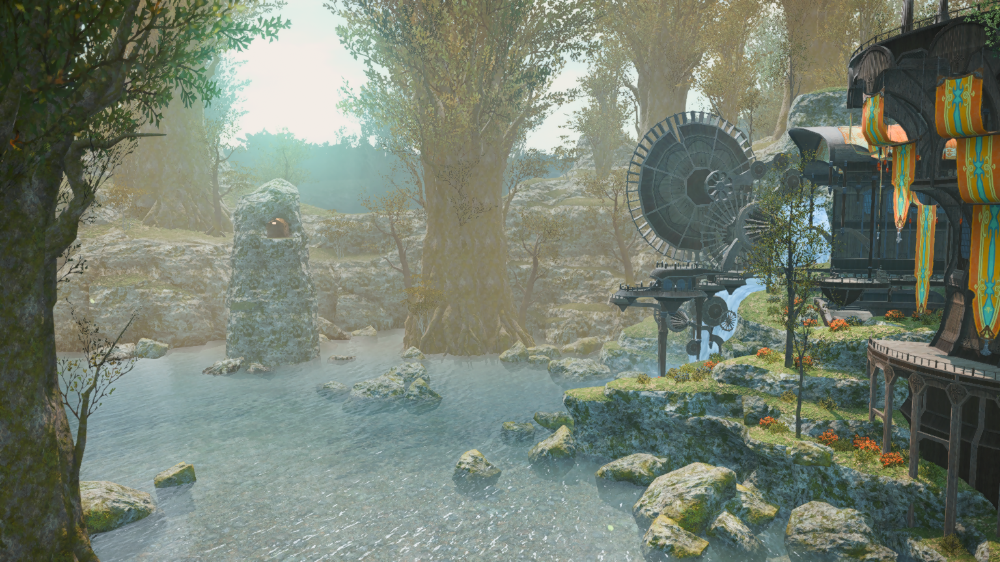

格里达尼亚是统领着黑衣森林地区的森林之都，格里达尼亚的建筑几乎完全由当地木材建造而成。森林之都以斐加加大水车而闻名于世，大水车驾驭着流入翡翠湖的河流的水力，带动着城市产业的发展。格里达尼亚的理念：平稳与协调。

  

格里达尼亚的守护神是大地与丰饶之神诺菲卡，诺菲卡是太阳神阿泽玛的女儿，也是海洋神利姆莱茵的妹妹。森林之都的人们相信元灵是从诺菲卡的本质中产生的，而元灵为森林的生命力和其守卫者提供力量，随时准备清除森林中的入侵者。元灵的存在在格里达尼亚人们的日常生活中感受最为强烈，许多节日和仪式也是为了纪念元灵而举行的。

黑衣森林中有许多「元灵」，常寄宿于树木之中。关于镇守在黑衣森林的元灵，历史中没有记载它到底生于什么时代，只能得知元灵早在第五星历无限城时代就存在于黑衣森林之中。元灵没有实体，是纯粹的以太、元素的结晶。元灵经常闹脾气，则是因为它本身就是元素生命体，感觉到以太波动便会变得极不稳定。当森林受到损害，元灵们便会进行修复，保持平衡。但元灵一旦陷于愤怒，便会驱除敌人。

「角尊」是人类与元灵沟通的枢纽，只诞生于人族的孩子之中，出生头上便长着一对角，与生俱来便具有强大魔力以及和元灵沟通的能力，且长命百岁，童颜不变。一般幼年的角尊们都被幻术师行会管理着，学有所成后则会加入元灵评议会，分享从元灵获得的知识，并协助实力最强的角尊——幻术皇。

历史上的第一位角尊，是森都成立之初，由元灵选中的幻术师首领的孩子，也就是现在的幻术师行会会长艾·斯密·雅恩。作为格里达尼亚角尊中最年长的一位，艾·斯密·雅恩说他在百岁时就不再去数自己的年龄了。因此，学者们只能对他的真实年龄进行推测，许多人认为他至少已230岁。他知识渊博，教导了很多更年轻的角尊，是他所担任的幻术师行会会长一职非常合适的人选。

格里达尼亚的国旗上，白色百合象征着人类与元灵的第一次交流，金色的底色则象征着这片土地充满了元灵的力量。交缠的两条白蛇，分别代表建国初期的人族和精灵族，象征着双方的互相协助才能得以有最初的国家——格尔莫拉，同时也象征着人族和精灵族一同建立格里达尼亚时的善意和团结。

元灵没有实体，人族和精灵族在与元灵长达五十年的漫长对话之后，在星历1076年终于把愿望传达给了元灵。元灵在了解到格尔莫拉人保护森林的意愿之后，获得了元灵的允许，越过设立在黑衣森林的结界，在森林中建立起了格里达尼亚城市，从此告别了在地下城市格尔莫拉的暗处生活，重见阳光。

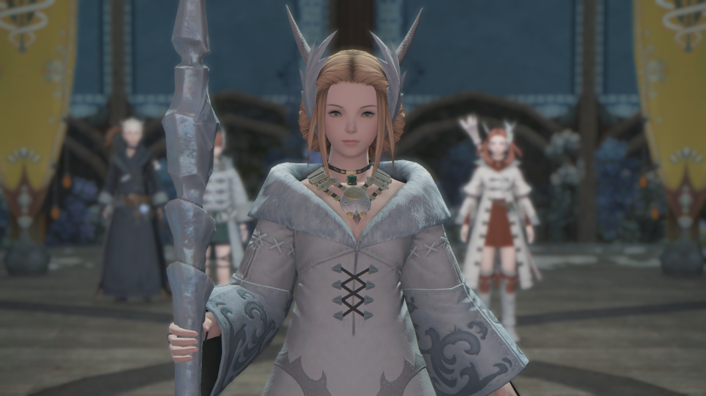

格里达尼亚的最高领导人，是以嘉恩·艾·神纳为首的三位幻术皇，其他两位为拉雅·奥和阿·卢恩，三人都是神纳一系的亲属。在第七灵灾前后，面对加雷马帝国和重建城邦的双重挑战，作为幻术皇之首的嘉恩·艾·神纳不仅身负调解森林元灵与其居民的职责，并且全面接管了评议会首领和大神官的全部权力，并至今进行亲政。

管辖格里达尼亚城邦的中央政府则是「元灵评议会」，由能够聆听元灵之声的幻术师所组成。而在格里达尼亚的幻术师中，只有极少的精英才能感知到元灵的声音，他们被称为「法师大人」。「幻术皇」则是作为法师大人的领袖，且大多为角尊同龄中最强的男女，能够与元灵的意志完美同调，由黑衣森林最年长的统治者元灵任命。

元灵评议会是法师大人们分享从元灵那里学习的知识、决定城邦事项的讨论会。事实上，评议会在这里拥有着最高的权力，也是格里达尼亚法律的仲裁者。裁决由投票决定，但相比于法师大人们的意见，政策有时会更强烈地反应元灵的意志。

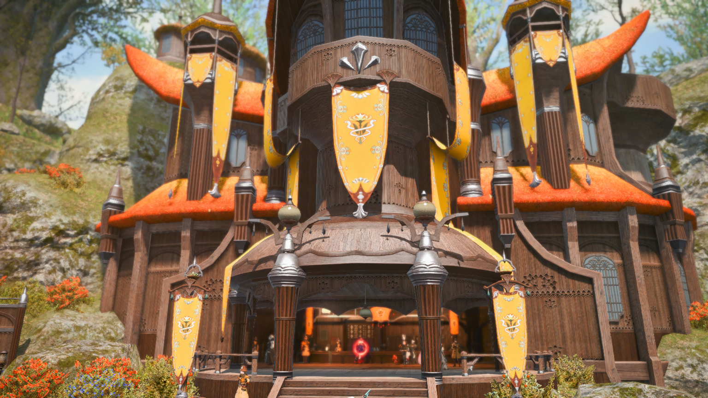

格里达尼亚为了保护森林远离威胁，组建了大国防联军双蛇党进行反抗的斗争。蛇巢司令部则是双蛇党的司令部，这座建筑是在第七灵灾之后新建的。

双蛇党由五个部队组成。粮草和制造交给“青貉队”，这是一支由从能工巧匠和大地使者行会中招募的技师和工兵组成的队伍。其次是“朱獭队”，一支从枪术师、弓箭手和幻术师行会选拔而成的精英战斗部队。想要为格里达尼亚服务的年轻人则加入“白狼队”战斗部队。第四，“玄猪队”为其他队伍提供后勤和支援，由从神勇队和鬼哭队退役的人员组成。最后，“黄蛇队”是一支只有冒险者的部队，在有需要时为其他四支队伍提供各种援助。所有部队由指挥中心“蛇巢司令部”统筹安排。

格里达尼亚周边的蛮族势力有两个：一个是崇拜蛮神“迦楼罗”的种族，还有一个是妖精族，一直以来对格里达尼亚持友好态度，最近却因为召唤蛮神“拉姆”而使得关系僵化。第七灵灾之后，森林受到了很大的创伤至今五年仍然没有痊愈，格里达尼亚一直持续着这种无法安定的状态，加雷马帝国也在森林中强硬地建立起了邪恶的堡垒。

格里达尼亚的理念是平稳与协调，一直注重森林的和谐，所以森都向来不是个好战的国家。复兴黑衣森林，提高森林的不可侵犯性，格里达尼亚认为这样就能达成和平。所以面对妖精族与鸟人族的来犯，也只是与妖精族谈判来缔结协议，对鸟人族也只是击退来犯之敌，而没有采取进一步的措施。但鸟人族是好战的蛮族，是格里达尼亚最大的仇敌，鸟人族仍旧没有改变侵略森林的计划，他们仍然在夺取自然的恩惠，扰乱元灵的心神。他们的蛮神迦楼罗不仅力量强大，还本性凶残。总有一天，双蛇党和鸟人族要用一场大战来解决问题，即使这不是格里达尼亚的本意......

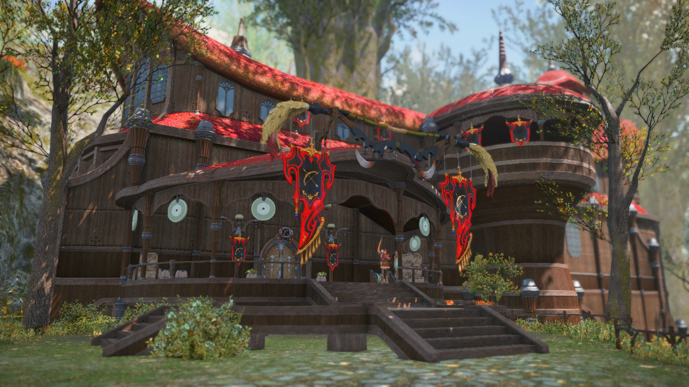

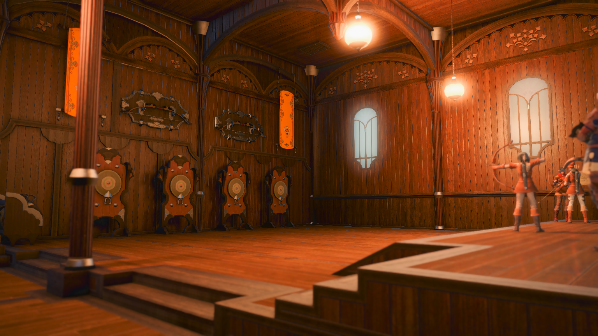

神勇队建立于1363年，主要由弓箭手组成，是格里达尼亚的眼目，是负责监视对外人入侵黑衣森林行为的精英部队，从遍布黑衣森林的瞭望塔中监视任何一丝外部入侵的痕迹。总部在神勇队司令部，与弓箭手行会共享一个建筑。

在损失惨重的加尔提诺战役后，神勇队被正式编入重组的大国防联军双蛇党。

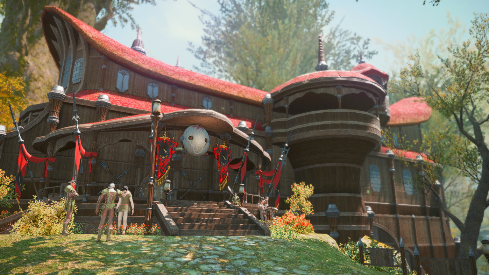

鬼哭队是在若斯兰队长的主张下，于格里达尼亚刚成立不久时集结的一群年轻枪兵。 鬼哭队的任务是守卫黑衣森林——遵循着这座林区城邦与元灵的誓约。为了守卫和平，从格里达尼亚城内到小村庄哨岗和瞭望塔，他们的驻军分布在黑衣森林各处，总部则位于枪术士行会。

鬼哭队的成员都戴着面具，意味着他们会拼尽全力保护森林及其居民，甚至在必要的情况下，不惜冒着招惹元灵的愤怒的风险。然而，元灵们并不用外表去识别人类，而是用他们灵魂的样貌。因此，「面具是否有效」这一问题很少有学术共识。

在加尔提诺战役后，也被正式编入重组的大国防联军双蛇党。

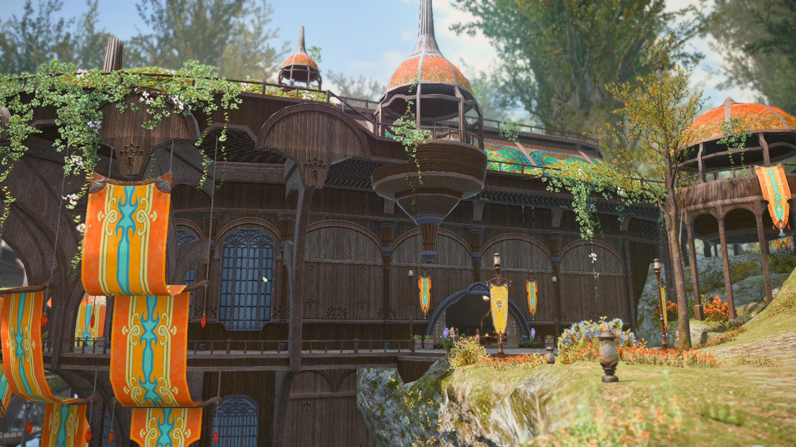

栖木旅馆是格里达尼亚最有名的旅馆，店主是博伊尔，并由其忠仆安托瓦诺管理。由高风飞行社所建的飞艇坪和旅馆直接相连，不仅冒险者常用，往来的旅行者和商人也经常在此投宿。

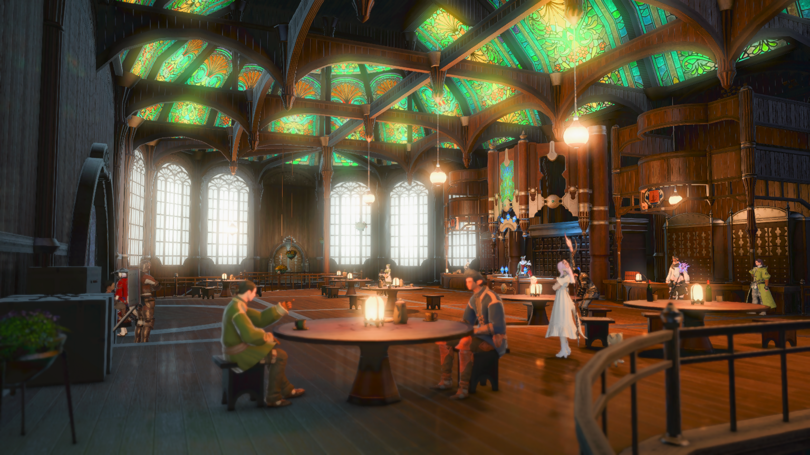

魔女咖啡馆是位于栖木旅馆内的咖啡馆。店名「魔女」指的是店长缪恩回忆中令她印象十分深刻的一种名为「魔女草」的植物。店内也设有冒险者行会的接待柜台，所以很多冒险者把这里当做了碰头地点。

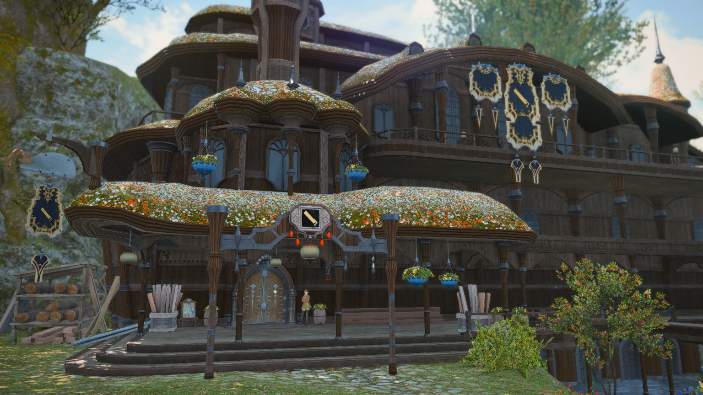

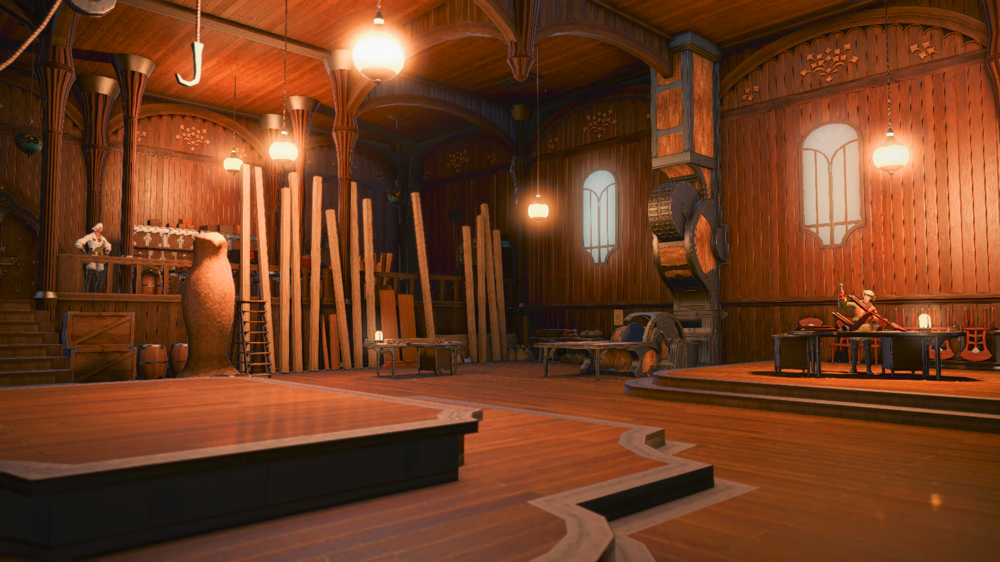

得益于黑衣森林中的大量优质木材，格里达尼亚人也自然发展起了刻木业。几乎没有他们不能塑造的——从日常用品到军需装备，从随处可见的木质建筑到河流中的船只，无不展示着高超的技艺。当然，最令格里达尼亚刻木匠们自豪的还是水车。无论从设计还是从建造上，在整个艾欧泽亚都无人能出其右。

古橡大堂是刻木匠们锯木生产的地方。大型密闭水车斐加加大水车提供的动力，提供了十分惊人的锯木速度，进而可以高效地制作各种材料。木匠们引以为傲。

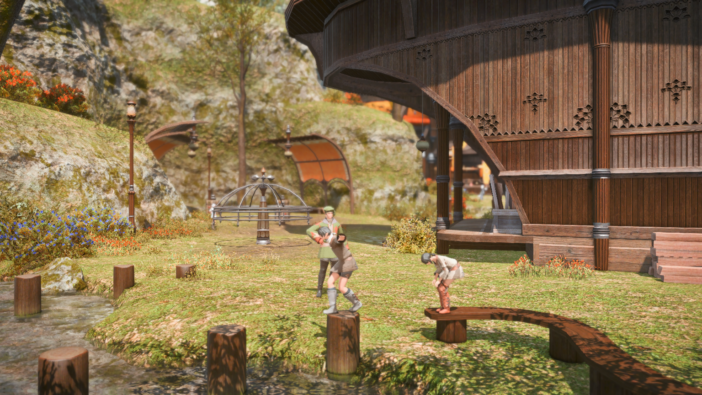

古橡大堂后方的橡子乐园是古橡大堂的高手工匠们，忙里偷闲做出来的小公园。从平衡木、蛇形木到奥猴像等所有的游戏设施，都是由刻木匠行会的顶尖师傅做出来的。孩子们可以通过亲手触摸这些设施，感受学习木头的性质。

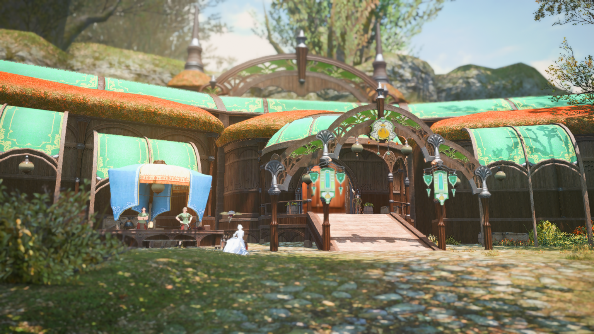

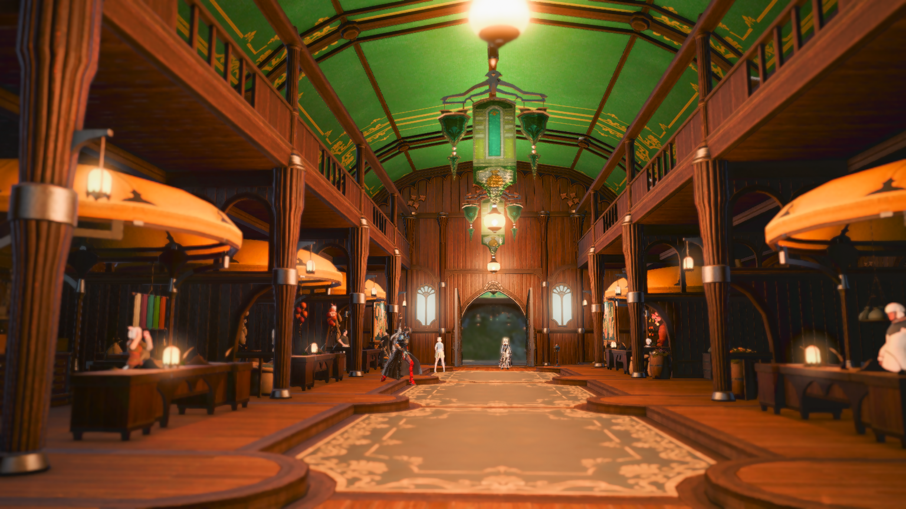

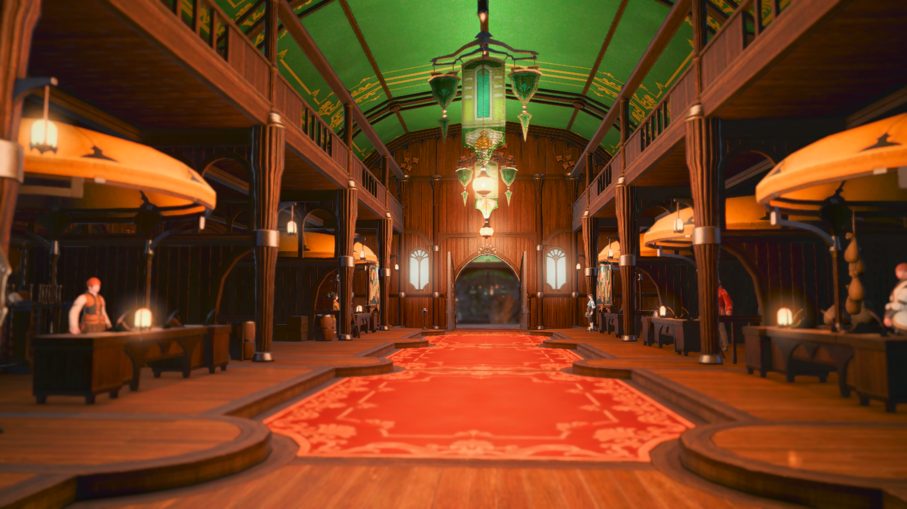

黑檀·紫檀商店街的名字来自于森都约一百年前的美丽传说。一位元灵的孩子去世时，其他森林元灵陷入深深的打击不能自拔，格里达尼亚很快大雪纷飞。树木都被冻住，野兽也全都出逃了，留下的人们被绝望所包围。此时，一对年幼的兄妹为了拯救自己已经放弃生存欲望的父母，前往森林深处寻找食物。在风雪交加的树林中，兄妹果不其然地走散了。为了寻找彼此，他们分别奏响了黑檀的齐特琴和吹响了紫檀的笛子。优美的旋律令元灵们苏醒了过来，驱散了森林中的寒流。不久，格里达尼亚重新盈满了生机——一切归功于音乐的力量。

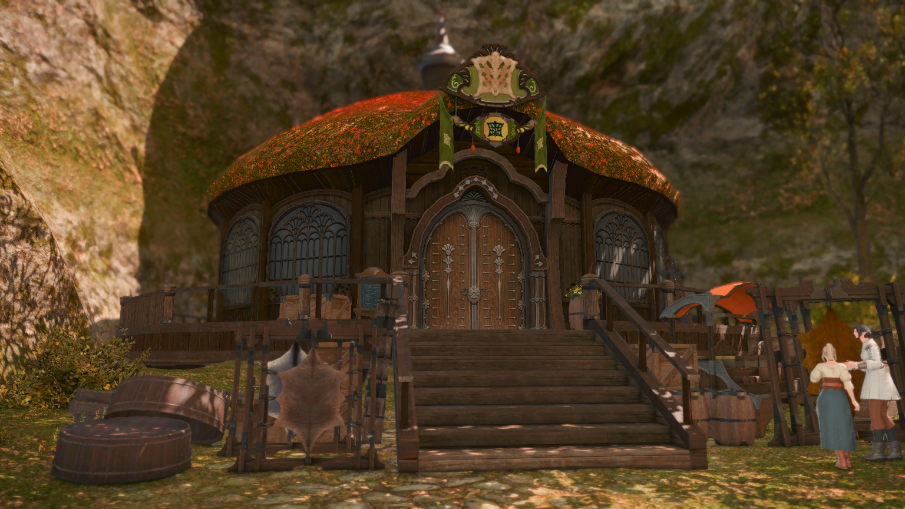

飞·乌尔时装店是皮革工艺店，是与乌尔达哈的太阳丝绸并驾齐驱的艾欧泽亚时尚品牌。精湛工匠的作品预约需要以月乃至年为单位才能预约到，十分受欢迎。

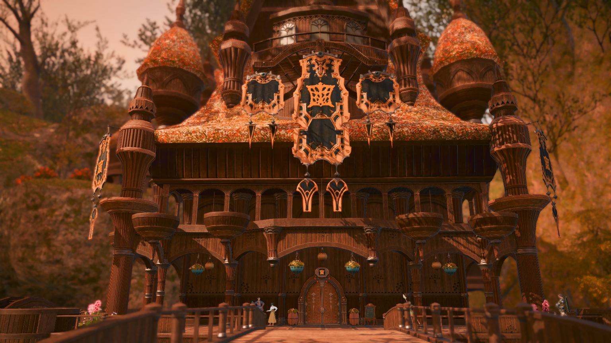

格里达尼亚的制革匠在整个艾欧泽亚都颇有名气，他们组成的工作室每天都在沉迷于对森林的恩惠进行加工。飞·乌尔工作室是其中尤为著名的一家工作室，技术不够的行会成员甚至没有资格冠上这个品牌，他们提供的商品一直都是供不应求。

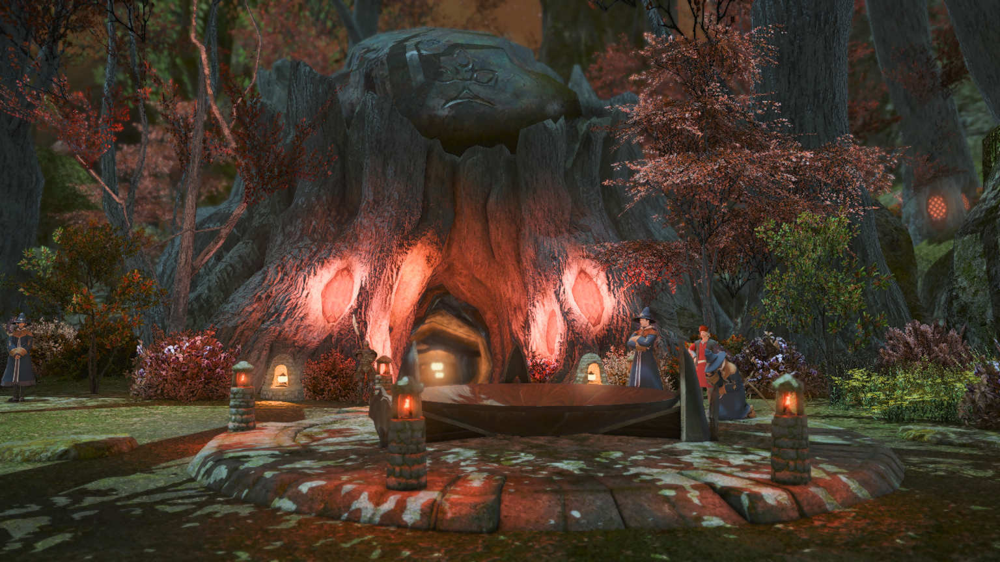

丰饶神祭坛是用于供奉丰收的女神诺菲卡的巨大石制盘子状祭坛，位于老树中的树洞。为了庆贺丰收，也是为了供奉森林的元灵，进行祭奠时会在里面奉上各种瓜果蔬菜、鸡鸭鱼肉。

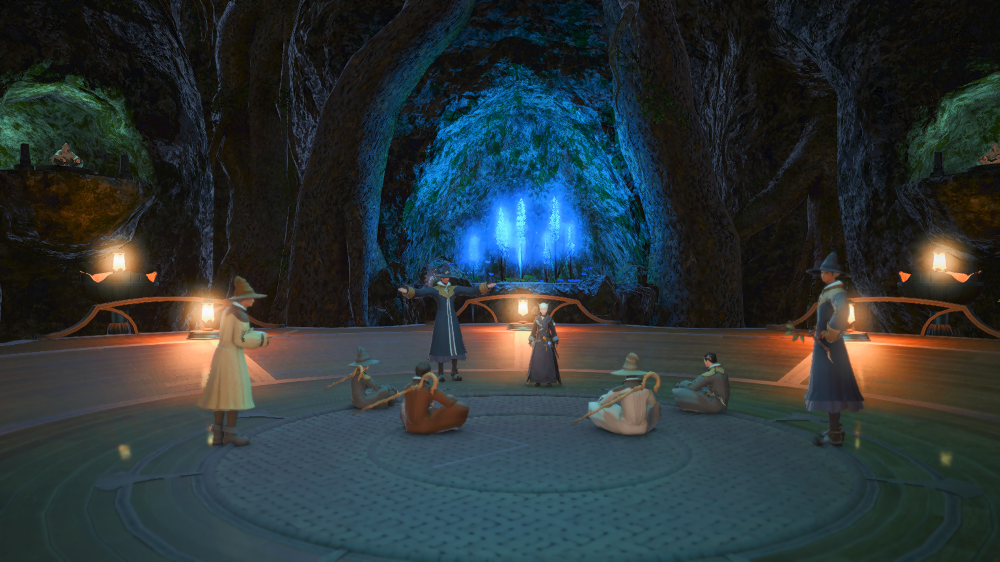

硕老树冥想窟是在大树的根部创造出的给幻术师们进行冥想的空间。为了能聆听常人听不见的元灵的低语，很多幻术师在雕刻出的洞穴中焚香，集中精神奋力修行。

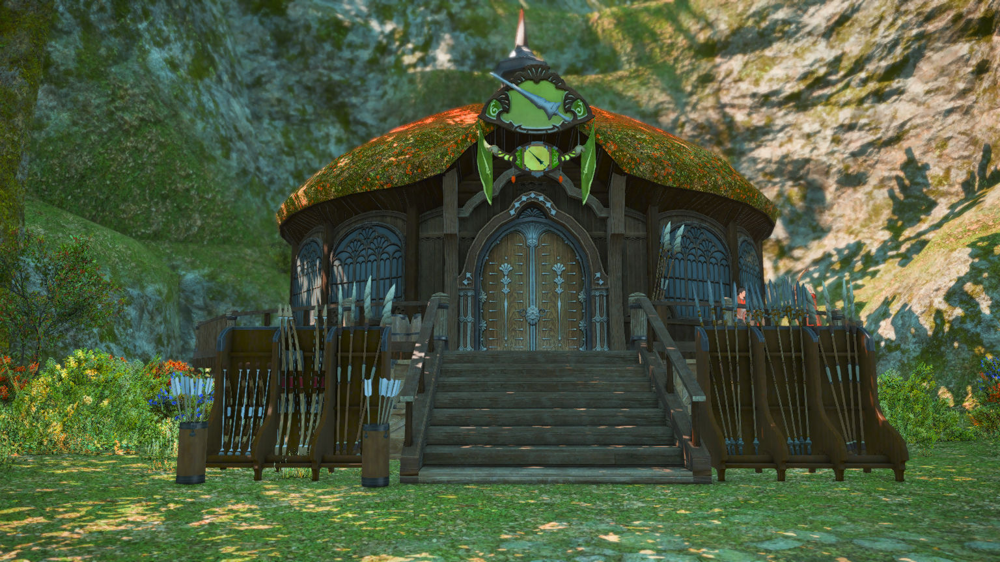

半人马之眼武具店是已经营超过150年的传统老武器店。最初遵循创业者家族所流传的家训“弓一筋”而仅售卖弓，但现在面向鬼哭队和外来冒险者的需求，也开始制作并出售枪。

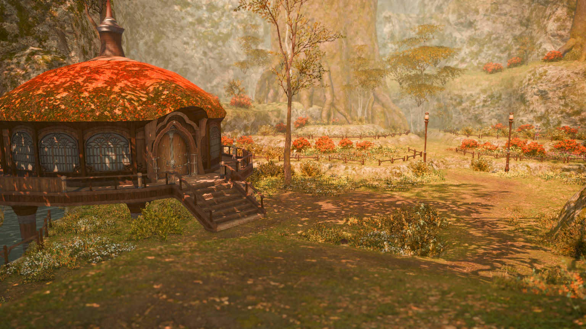

作为黑衣森林中最肥沃的土地之一，几百年来这片土地都是一个富商家族的私有财产。在一次出人意料的善举中，格雷洛姆家族将这大片土地以女神诺菲卡的名义捐给了格里达尼亚。如今，园艺工行会管理着格雷洛姆农场，将这些地分块出售给最有潜力的园艺工成员。

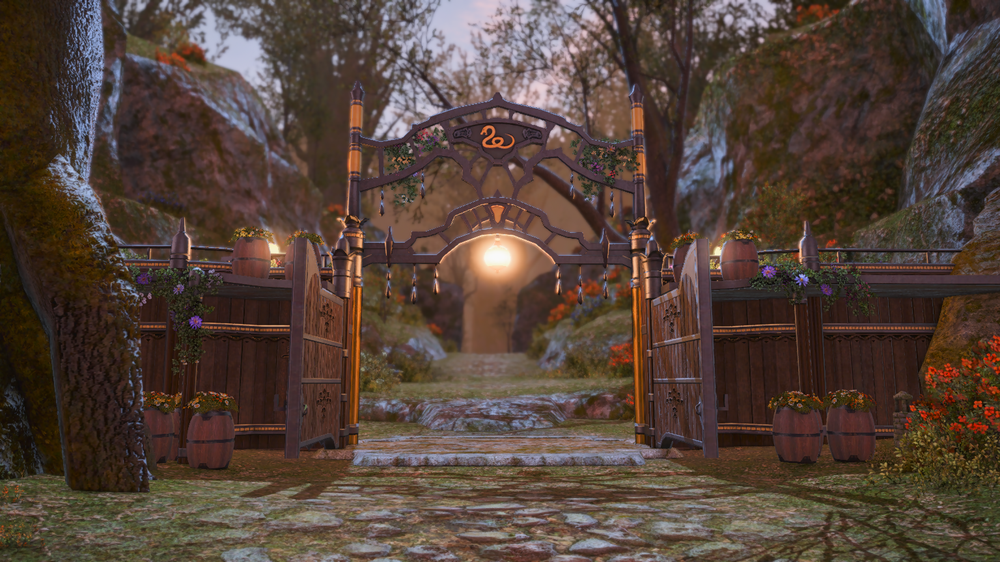

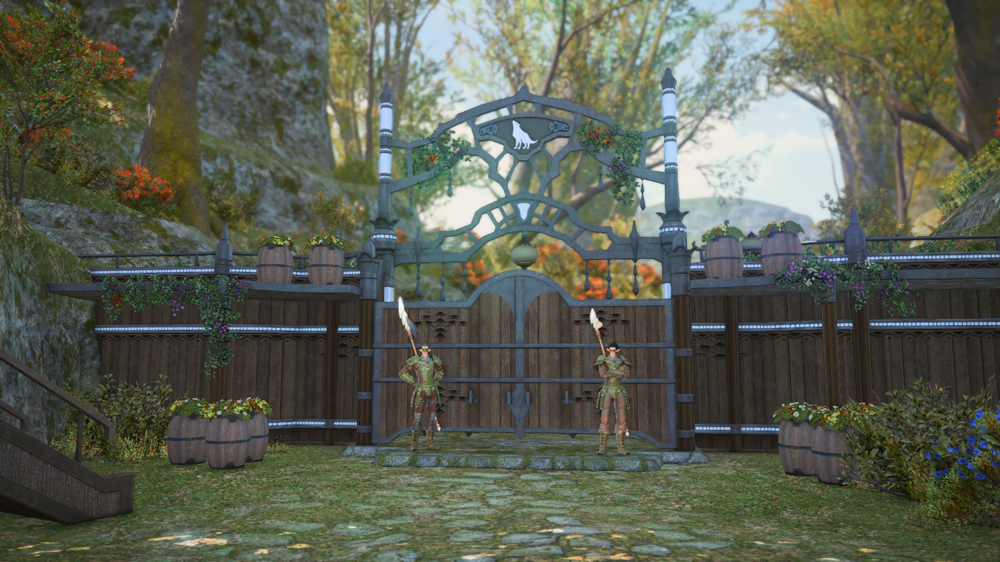

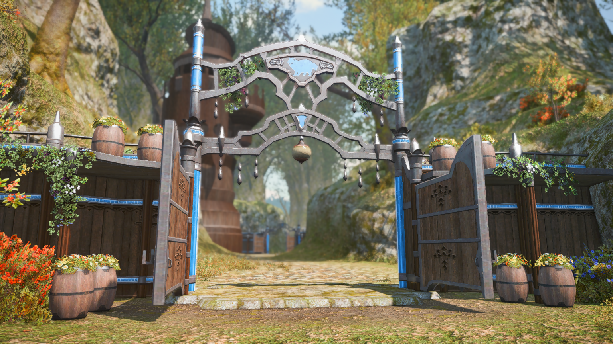

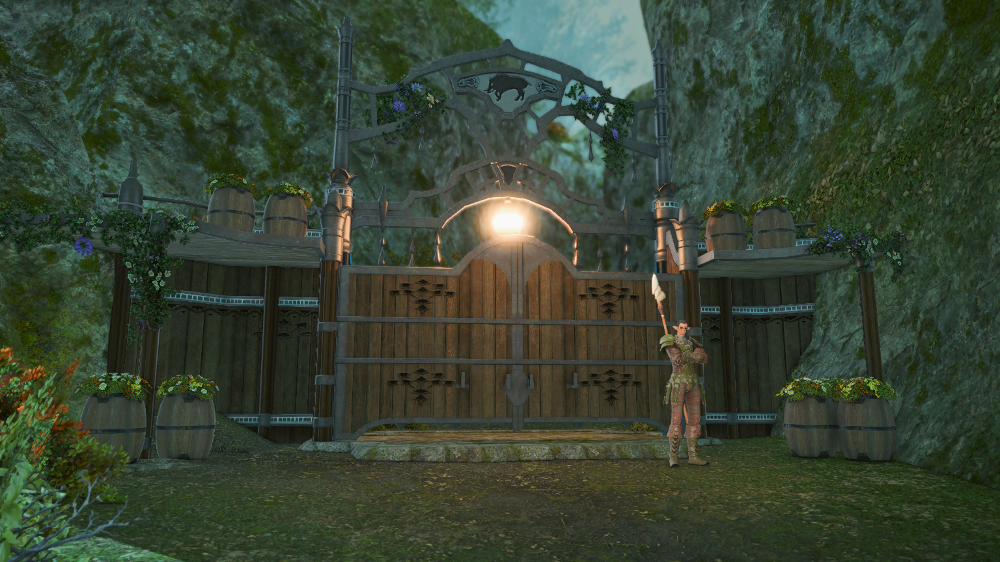

森都一共有四个主门，分别为黄蛇门、白狼门、青貉门、玄猪门，名字都来源于守护四方的幻兽。

