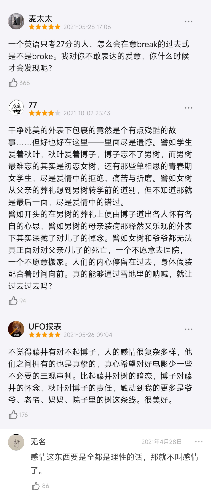



<!-- timeline 01-02 -->

今天看了岩井俊二的电影《情书》💌
其实之前一直想看来着，但是心情总是很浮躁看一点就看不下去了，感觉是需要静下心来慢慢欣赏的作品。
好吧，我承认我一开始把藤井树和渡边博子搞混了，我还在寻思怎么女主有两幅面孔，一会儿淘气一会儿内敛的😂直到看到渡边博子去往藤井树家，两人相会的时候我才反应过来，哦——原来是两个长得很像的人而已啊，原来之前的故事线一直都是穿插着两个人的生活，sorry我的反射弧比较长……不过还是很惊叹，没想到居然是一个人同时饰演两个性格截然不同的角色，感叹一句中山美穗的演技很好，两个角色都演的很自然~
唯一让我泪目的片段，是爷爷在大雪的夜晚，执意背着病危的藤井树去往医院的那一段，莫名就是很戳泪点，爷爷和母亲回想起了死于肺炎的藤井树的爸爸…就好像这件事明明大家口头上都说已经释怀了，但是其实大家心里仍然对父亲的死亡是耿耿于怀的吧…
一直看到最后，我一直在想女藤井树那时到底喜不喜欢男藤井树呢？男藤井树又是否喜欢女藤井树呢？这个问题的答案，直到看到电影最后书中夹着的借书卡背后的画像，我才终于明白…原来男藤井树是暗恋过女藤井树的，但女藤井树似乎并没有那个心思，可能是一根筋或者是沉迷于学习吧……只能说大哥你真的很能藏小心思，我直到看到借书卡我才知道你原来真的有暗恋过，之前的所有互动我都以为你只是一个直男……
不过话说回来，难道男藤井树真的是因为博子长得像女藤井树才会向博子求婚的吗？我觉得这个我有点难以接受哎，这不就等于是把博子当替身了吗？不过好在博子现在有了新的恋人，想必经过此事之后，博子应该能够真正地走出这段逝去的感情，投入现在这份感情之中了吧，也未尝不是一件好事…
总结来看的话，我觉得电影的音乐真的很优美，整部电影就像是一首诗，一首含蓄内敛的情诗~然后岩井俊二的摄影美学也很不错，感觉哪天可以深入学习一下~两位藤井树的青春时期的回忆片段的剧情也很有趣，然后男藤井树的演员长得还挺帅的哈哈，就很有那种氛围~然后最后博子在雪地向高山呼喊的片段也是很经典了，结合电影前期博子那十分内敛的性格，能够像这样大喊一嗓子确实是很不容易呢！可以看出博子终于走出了那段感情。
如果说有意难平的地方的话，就是青春时期的男藤井树为什么不向女藤井树表白自己的心意呢？难道是因为要搬家转学而无奈吗？总之挺意难平的，最后还因为登山事故而死去，今天又是听一个已死之人的生前故事而感动的一天，请大家珍爱生命，这样幸福才会永存……
很好奇男藤井树是什么时候暗恋上的她呢？所以那些借书卡上写下的的一个个“藤井树”，其实是在表达着对藤井树的爱恋？感觉这样还挺浪漫的，这是一种只能在男女主同名情况下才能产生的一种暗恋的美感哈哈~但是有一说一，这种暗恋的细腻和美好，一定要从发现自己是白月光替身的这种角度来切入吗……
收集了一些还不错的影评~

<!-- endtimeline -->





<!-- timeline 08-07 -->

与其说是升级和进化
不如说是回到了最原本的形态
人们原本就有着强大的力量
只不过是因为种种事情封闭了他们原本的力量
从而遗忘了他们自身的强大
如果想要回到最初的形态
人们需要找到原本的自我

——女神异闻录5  人格面具的最终形态

<!-- endtimeline -->

<!-- timeline 07-20 -->

[Newjeans  Cool With You](https://www.bilibili.com/video/BV1xj411R7Mi?p=1&vd_source=683accdf4a366c372d15625bf59c99d7)

God is with you 

but you never noticed 

before that,you should find yourself.

<!-- endtimeline -->

<!-- timeline 03-29 -->

[【4K/60FPS】全站最高画质 86-超大型网恋奔现现场！蕾娜首次与辛见面](https://www.bilibili.com/video/BV1Y3411s784/?spm_id_from=333.337.search-card.all.click&vd_source=683accdf4a366c372d15625bf59c99d7)

看到了B站大家剪的86不存在的战区的大结局，大家终于相见了！！！！这一幕真的好感动！！！！😭😭

看到这一幕，我真的觉得自己此生入ACG无悔了，这就是我热爱动画的理由啊！！😭😭

86，心中永远的神番！

<!-- endtimeline -->

<!-- timeline 01-20 -->

[【原神夜兰传说任务】天叔后续+过场动画](https://www.bilibili.com/video/BV1rW4y1C7NX/?spm_id_from=333.337.search-card.all.click&vd_source=683accdf4a366c372d15625bf59c99d7)

权谋算计固然重要

更重要的却是恪守本心

权谋算计永无止休 应付不来的话 

倒不如置身事外  反而能看清许多东西

每个人都有欲望  但不可被欲望掌控 

不必计较暂时的得失  向着内心所想的方向前进就好

人生就像垂钓  容不得半点焦躁

做人做事  都不可急于求成

年轻的时候总想着证明自己

后来才意识到

事情并不总会如我预想的那样发展

把心沉下来才能继续前进

你还年轻  要耐得住寂寞  要相信自己  不必靠外物去证明你的价值

——天枢星.天叔

<!-- endtimeline -->

